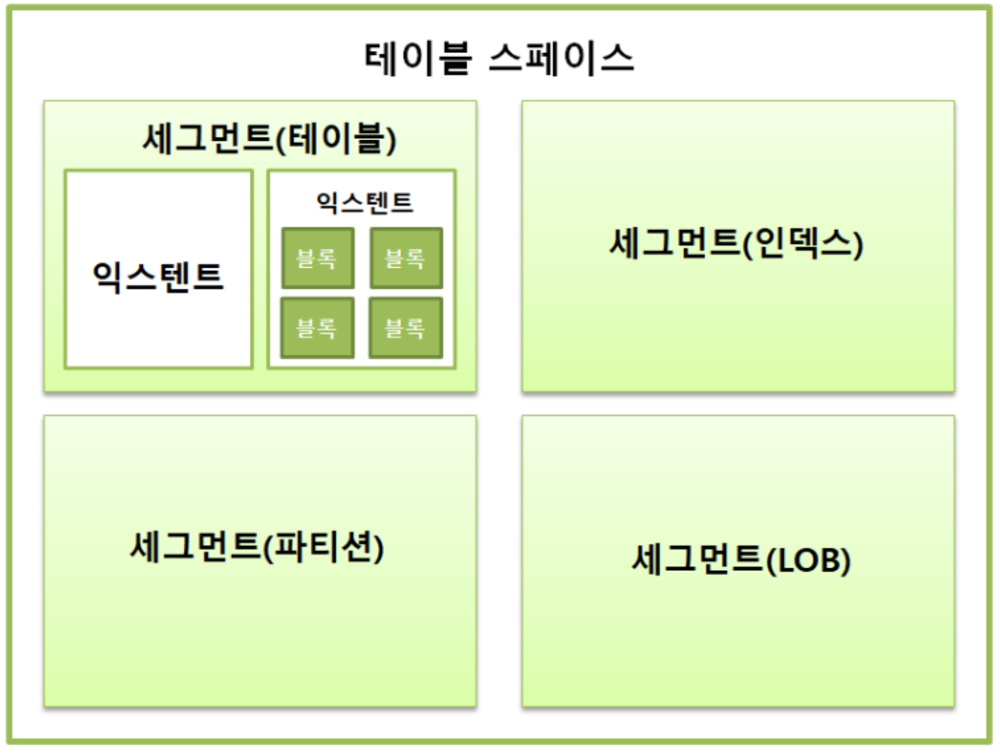
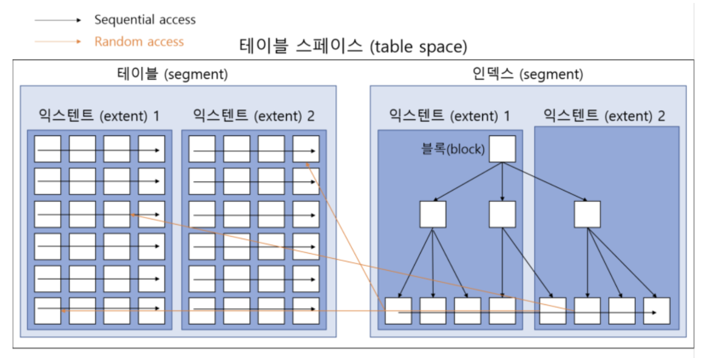

# SQL 처리 과정과 I/O

## SQL 파싱과 최적화

### 구조적, 집합적, 선언적 질의 언어

- SQL은 ‘Structured Query Language’로 구조적 질의 언어
- structured, set-based, declarative
- 원하는 결과 집합을 만드느 프로시저 생성을 SQL 옵티마이저가 수행
- 옵티마이저가 대신 프로그래밍을 해 주는 셈
- SQL 최적화: DBMS 내부에서 프로시저를 작성하고 컴파일해 실행 가능한 상태로 만드는 전 과정

### SQL 최적화

1. SQL 파싱
    - 파싱 트리 생성: SQL 문을 이루는 개별 요소 분석
    - Syntax 체크: 문법적 오류 확인
    - Semantic 체크: dmlaltkd dhfb cpzm
2. SQL 최적화
    - 다양한 실행 경로를 생성해서 비교한 후 가장 효율적인 하나 선택
    - 데이터베이스의 성능을 결정하는 가장 핵심 엔진
3. 로우 소스 생성
    - 옵티마이저가 선택한 실행 경로를 프로시저 형태로 생성

### SQL 옵티마이저

- 옵티마이저의 최적화 단계
    1. 사용자로부터 전달받은 쿼리를 수행하는 데 후보가 될 실행 계획 찾기
    2. 데이터 딕셔너리에 미리 수집해 둔 오브젝트와 통계를 통해 실행 계획의 예상 비용 산정
    3. 최저 비용 실행 계획 선택

### 옵티마이저 힌트

- 옵티마이저는 대부분 좋은 선택을 하지만 완벽하진 않음
- SQL이 복잡할수록 실수할 가능성이 높아짐
- 통계 정보에 담을 수 없는 데이터나 업무 특성은 개발자의 직접 선정 필요
- 옵티마이저 힌트 사용
- 힌트 사용법: 주석에 ‘+’ 기호
    
    ```sql
    SELECT /*+ INDEX(A 고객_PK) */ 
    	고객명, 연락처, 주소, 가입일시
    FROM 고객 A
    WHERE 고객ID = '000000008';
    ```
    
- 힌트 안 인자에는 콤마 사용 가능, 힌트끼리는 콤마 사용 불가능
    
    ```sql
    /*+ INDEX(A A_X01) INDEX(B, B_X01) */ -> 모두 유효
    /*+ INDEX(C), FULL(D) */ -> 첫 번째만 유효
    ```
    
- 테이블 지정 시 스키마명 명시 불가능
    
    ```sql
    SELECT /*+ FULL(SCOTT.EMP) */ -> 무효
    FROM EMP;
    ```
    
- FROM 절 옆에 ALIAS를 지정했다면 힌트에도 해당 ALIAS 사용
    
    ```sql
    SELECT /*+ FULL(EMP) */ -> 무효
    FROM EMP AS E;
    ```
    

## SQL 공유 및 재사용

### 소프트 파싱 vs 하드 파싱

- 라이브러리 캐시: 내부 프로시저를 반복 재사용할 . 수있도록 캐싱해 두는 메모리 공간
- 라이브러리 캐시는 SGA(Server Global Area) 구성요소로 서버 프로세스와 백그라운드 프로세스가 공통으로 접근하는 데이터와 제어 구조 캐싱하는 메모리 공간
- 소프트 파싱: SQL을 캐시에서 찾아 바로 실행 단계로 가는 것
- 하드 파싱: SQL을 캐시에서 찾지 못해 최적화 및 로우 소스 구성 단계까지 모두 거치는 것
- SQL 최적화가 하드한 이유
    - 조인 순서, 조인 방식, 스캔 방식 등 다양한 실행 경로 존재
    - 옵티마이저는 이 실행 경로의 비용을 계산하는 무수한 계산 실행
    - 이렇게 어려운 작업을 거쳐 생성한 내부 프로시저를 한 번만 사용하고 버리면 매우 비효율적

### 바인드 변수의 중요성

- 이름 없는 SQL 문제
    - 함수, 프로시저, 트리거, 패키지는 영구적인 이름을 가짐
    - SQL은 이름이 없고 전체 텍스트가 이름 역할을 수행
    - SQL의 작은 부분이라도 수정되면 그 순간 다른 객체가 생성되는 구조
- 공유 가능 SQL
    - 라이브러리 캐시에서 SQL을 찾기 위해 사용하는 키 값이 SQL문 . 그자체이기에 아래 코드는 모두 라이브러리 캐시에서 별도의 공간 사용
        
        ```sql
        SELECT * FROM emp WHERE empno = 7900;
        select * from emp where empno = 7900;
        SELECT * from emp where empno = 7900;
        ```
        
    - 아래 함수는 실행될 때마다 매번 다른 SQL문을 생성하고 라이브러리 캐시에 별도의 객체 생성
        
        ```java
        public void login(String login_id) throws Exception {
        	String SQLStmt = "SELECT * FROM CUSTOMER WHERE LOGIN_ID= '" + login_id + "'";
        	Statement st = con.createStatement();
        	ResultSet rs = st.executeQuery(SQLStmt);
        }
        ```
        
    - 파라미터 Driven 방식으로 SQL을 작성해 하나의 프로시저를 공유하면서 재사용
        
        ```java
        public void login(String login_id) throws Exception {
        	String SQLStmt = "SELECT * FROM CUSTOMER WHERE LOGIN_ID= ?";
        	Statement st = con.prepareStatement(SQLStmt);
        	st.setString(1, login_id);
        	ResultSet rs = st.executeQuery(SQLStmt);
        }
        ```
        

## 데이터 저장 구조 및 I/O 매커니즘

### SQL이 느린 이유

- I/O란 잠: 운영체제가 I/O를 처리하는 동안 프로세스는 잠을 자기 때문
- interrupt가 없어도 디스크에서 데이터를 읽어야 할 때는 CPU를 OS에 반환하고 잠시 수면
- 디스크 I/O가 SQL의 성능을 좌우

### 데이터베이스 저장 구조



- 테이블스페이스: 세그먼트를 담는 콘테이너로 여러 개의 데이터파일로 구성
- 세그먼트: 테이블, 인덱스처럼 데이터 저장 공간이 필요한 오브젝트
    - 테이블, 인덱스를 생성할 때 데이터를 어떤 테이블 스페이스에 저장할지 지정
    - 세그먼트는 여러 익스텐드로 구성
        - 테이블도 하나의 세그먼트. 인덱스도 하나의 세그먼트
        - 파티션 구조라면 각 파티션이 하나의 세그먼트
- 익스텐트: 공간을 확장하는 단위
    - 테이블이나 인덱스에 데이터를 입력하다가 공간이 부족해지면 해당 오브젝트가 속한 테이블스페이스로부터 익스텐트를 추가로 할당
- 블록: 사용자가 입력한 레코드를 실제로 저장하는 공간
    - 한 블록은 하나의 테이블이 독점
    - 한 익스텐트도 하나의 테이블이 독점하기에 한 익스텐트에 담긴 블록은 모두 같은 테이블 블록

| 단어 | 뜻 |
| --- | --- |
| 블록 | 데이터를 읽고 쓰는 단위 |
| 익스텐트 | 공간을 확장하는 단위, 연속된 블록 집합 |
| 세그먼트 | 데이터 저장 공간이 필요한 오브젝트 |
| 테이블스페이스 | 세그먼트를 담는 콘테이너 |
| 데이터파일 | 디스크 상의 물리적인 OS 파일 |


- 세그먼트가 부족해지면 테이블스페이스로부터 익스텐트를 추가로 할당받는데, 세그먼트에 할당된 익스텐트가 파일 경합을 줄이기 위해 여러 데이터파일에 분산해서 저장 가능

### 블록 단위 I/O

- 파일의 입출력을 요구할 때, 블록 단위로 I/O 진행 → 하나를 알고 싶어도 한 블록을 조사
- 오라클은 기본적으로 8KB의 블록을 사용

### 시퀀셜 액세스 vs. 랜덤 액세스

- 테이블이나 인덱스 블록을 액세스하는 방법


- 시퀀셜 액세스: 논리적 또는 물리적으로 연결된 순서에 따라 차례대로 블록을 읽는 방식
    - 인덱스 리프 노드 스캔: 인덱스에는 리프 노드가 linked list로 구성되어 있기에 리프노드 순차적 탐색
    - 테이블 full scan: 테이블 블록은 서로 연결을 가지고 있지 않음
        - 오라클 같은 데이터베이스는 세그먼트 헤드에 익스턴트 맵이라는 각 익스턴트의 첫 블록 주소값을 저장하는 자료 구조를 가지고 있어서 full scan 가능
- 랜덤 액세스: 논리적, 물리적 순서를 따르지 않고 레코드 하나를 읽기 위해 한 블록씩 접근하는 방식

### 논리적 I/O vs. 물리적 I/O

**DB 버퍼 캐시**

- 자주 읽는 블록을 매번 디스크에서 읽는 것은 비효율적이기에 캐싱 매커니즘 활용
- 라이브러리 캐시: SQL과 실행계획 DB저장형 함수 프로시저를 캐싱하는 코드 캐시
- DB 버퍼 캐시: 자주 쓰는 데이터를 캐싱해 둔 데이터 캐시

**논리적 I/O vs 물리적 I/O**

- 논리적 I/O
    - SQL을 처리하는 과정에서 발생한 총 블록
    - 메모리상의 버퍼 캐시를 경유하기에 메모리 I/O이기도 함
- 물리적 I/O
    - 디스크에서 발생한 총 블록 I/O
    - 버퍼 캐시에 없는 데이터만 액세스하기 때문에 논리적 I/O의 일부만 물리적 I/O

**버퍼 캐시 히트율**

- 버퍼 캐시의 효율을 측정하는 데 사용된 지표
- BCHR = (캐시에서 곧바로 찾은 블록 수 / 총 읽은 블록 수 ) * 100
- BCHR = ((논리적 I/O - 물리적 I/O) / 논리적 I/O) * 100
- 평균 99%의 히트율을 달성해야 함
- 논리적 I/O를 줄임르로써 물리적 I/O를 줄이는 것이 SQL 튜닝
- BCHR이 SQL 성능을 좌우하지만 BCHR이 좋다고 해서 좋은 SQL은 아님

### Single Block I/O vs. Multi Block I/O

- Single Block I/O: 한 블록씩 요청해서 디스크 → 버퍼 캐시 → 읽기
    - 인덱스 루트 블록 읽을 때
    - 인덱스 루트 블록에서 얻은 주소 정보로 브랜치 블록 읽을 때
    - 인덱스 루트 블록에서 얻은 주소 정보로 리프 블록 읽을 때
    - 인덱스 루트 블록에서 얻은 주소 정보로 테이블 블록 읽을 때
- Multi Blick I/O: 여러 블록씩 요청해서 디스크 → 버퍼 캐시 → 읽기
    - 많은 데이터를 읽을 때 (인접한 블록들 읽기)
    - 프로세스가 중단되는 횟수를 줄일 수 있음

### Table Full Scan vs. Index Range Scan

- Table Full Scan: 테이블에 속한 블록 전체를 읽어서 사용자가 원하는 데이터를 찾는 방식
- Index Range Scan: 인덱스를 이용한 테이블 스캔으로 ROWID를 통해 테이블 레코드를 찾아 가는 방식
- Full Scan을 피하는 것도 중요하지만 인덱스가 SQL의 성능을 떨어뜨리는 경우도 잦음
    - Table: 시퀀셜 액세스와 Multi Block I/O로 읽어 한번에 읽어들이고 캐시에 없는 경우 한 번의 프로세스 중단 발생
    - Index: 랜덤 액세스와 Single Block I/O로 읽어 레코드 하나를 읽기 위해 매번 프로세스 중단 발생
