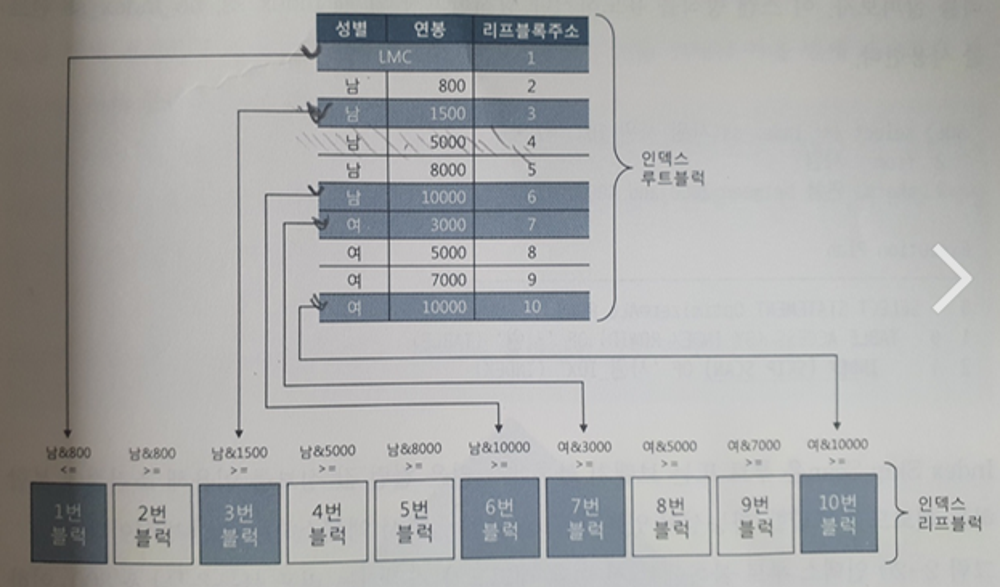

# 2. 인덱스 기본

# 2.1 인덱스 구조 및 탐색

## 2.1.1 미리 보는 인덱스 튜닝

### 데이터를 찾는 두 가지 방법

홍길동 학생을 찾는 방법은 두 가지

- 1학년 1반부터 6학년 맨 마지막 반까지 돌며 찾는 방법
    - 테이블 전체 스캔
- 학생명부를 조회해 홍길동 학생이 있는 교실만 찾아가는 방법
    - 인덱스 이용

### 인덱스 튜닝의 두 가지 핵심요소

인덱스는 큰 테이블에서 소량 데이터를 검색할 때 사용한다.

- 인덱스 스캔 과정에서 발생하는 비효율을 줄이는 것.
    - 인덱스 스캔 효율화 튜닝
- 테이블 액세스 횟수를 줄이는 것.
    - 인덱스 스캔 후 테이블 레코드를 액세스할 때 랜덤 I/O 방식을 사용하므로 랜덤 액세스 최소화 튜닝이라고 한다.
    - `랜덤 액세스 최소화 튜닝`이 더 중요하다.
- SQL 튜닝은 랜덤 I/O와의 전쟁이다.

### SQL 튜닝은 랜덤 I/O와의 전쟁

- 데이터베이스 성능이 느린 이유는 디스크 I/O 때문이다.
- 읽어야 할 데이터량이 많고, 그 과정에 디스크 I/O가 많이 발생할 때 느리다.
- 인덱스를 많이 사용하는 OLTP에서는 디스크 I/O 중에서 랜덤 I/O가 특히 중요하다.

## 2.1.2 인덱스 구조

- 인덱스는 대용량 테이블에서 필요한 데이터만 빠르게 효율적으로 액세스하기 위해 사용하는 오브젝트다.
- 인덱스가 없으면 테이블 풀 스캔
- 인덱스가 있으면 일부만 읽고 멈출 수 있다. (Range Scan이 가능)
    - 범위 스캔이 가능한 이유는? 인덱스가 정렬되어 있기 때문이다.
- 일반적으로 B*Tree 인덱스

### 인덱스는 Root, Branch, Leaf로 구성

- Root, Branch
    - 하위 블록에 대한 주소값을 갖는다.
    - 키값은 하위 블록에 저장된 키값의 범위를 나타낸다.
    - 키값을 갖지 않는 특별한 레코드: LCM(Leftmost Child)
        - 자식 노드 중 가장 왼쪽 끝에 위치한 블록을 가리킨다.
- Leaf
    - 리프 블록에 저장된 각 레코드는 키값 순으로 정렬되어 있다.
    - 테이블 레코드를 가리키는 주소값, 즉 ROWID를 갖는다.
    - 인덱스 키값이 같으면 ROWID 순으로 정렬된다.
    - 인덱스를 스캔하는 이유는, 검색 조건을 만족하는 소량의 데이터를 빨리 찾고 거기서 ROWID를 얻기 위해서다.
    - ROWID는 아래와 같이 데이터 블록 주소(DBA)와 로우 번호로 구성되므로 이 값을 알면 테이블 레코드를 찾아갈 수 있다.
- ROWID = 데이터 블록 주소 + 로우 번호
- 데이터 블록 주소 = 데이터 파일 번호 + 블록 번호
- 블록 번호: 데이터파일 내에서 부여한 상대적 순번
- 로우 번호: 블록 내 순번

## 2.1.3 인덱스 수직적 탐색

- 정렬된 인덱스 레코드 중 조건을 만족하는 첫 번째 레코드를 찾는 과정이다.
    - `인덱스 스캔 시작 지점을 찾는 과정`
- 인덱스 수직적 탐색은 Root → Branch → Leaf로 탐색한다.

## 2.1.4 인덱스 수평적 탐색

- 수직적 탐색을 통해 스캔 시작점을 찾았으면, `찾고자 하는 데이터가 더 안 나타날 때까지 인덱스 리프 블록을 수평적으로 스캔한다.`
- 인덱스에서 본격적으로 `데이터를 찾는 과정이다.`
- Leaf 블록끼리는 서로 앞뒤 블록에 대한 주소값을 갖는다. 즉, 양방향 연결 리스트(double linked list) 구조다.
    - 좌에서 우로, 또는 우에서 좌로 수평적 탐색이 가능한 이유다.
- 수평적 탐색하는 이유
    - 조건절을 만족하는 데이터를 모두 찾기 위해서
    - ROWID를 얻기 위해서
        - 필요한 컬럼을 인덱스가 모두 갖고 있어 인덱스만 스캔하고 끝나는 경우도 있지만, 일반적으로 인덱스를 스캔하고서 테이블도 액세스한다. 이 떄 ROWID가 필요하다.

## 2.1.5 결합 인덱스 구조와 탐색

- 두 개 이상 컬럼을 결합해서 인덱스를 만들 수 있다.
- 수직적 탐색을 거쳐서 찾은 인덱스 스캔 시작점이 성별 = ‘남’ 이면서 고객명 = ‘이재희’인 레코드
- 인덱스를 (고객명, 성별)로 구성하든, (성별, 고객명)으로 구성하든 읽는 인덱스 블록 개수가 똑같다.

# 2.2 인덱스 기본 사용법

- 인덱스 기본 사용법은 인덱스를 Range Scan 하는 방법을 의미한다.
- 인덱스 확장기능은 Index Range Scan 이외의 다양한 스캔 방식을 말한다.

## 2.2.1 인덱스를 사용한다는 것

- 인덱스 컬럼(선두 컬럼)을 가공하지 않아야 인덱스를 정상적으로 사용할 수 있다.
- `인덱스를 정상적으로 사용한다.` 라는 표현은 리프 블록에서 스캔 시작점을 찾아 거기서부터 스캔하다가 중간에 멈추는 것을 의미한다.
- 즉 리프 블록 일부만 스캔하는 Index Range Scan을 의미한다.
- 인덱스 컬럼을 가공해도 인덱스를 사용할 수 있지만, 스캔 시작점을 찾을 수 없고 멈출 수도 없어 리프 블록 전체를 스캔해야만 한다. 즉, 일부가 아닌 전체를 스캔하는 Index Full Scan 방식으로 작동한다.

## 2.2.2 인덱스를 Range Scan 할 수 없는 이유

> “인덱스 컬럼을 가공하면 인덱스를 정상적으로 사용(Range Scan)할 수 없다.”
>
- 인덱스 컬럼을 가공했을 때 인덱스를 정상적으로 사용할 수 없는 이유는 `인덱스 스캔 시작점을 찾을 수 없기 때문이다.`
- Index Range Scan에서 ‘Range’는 범위를 의미한다.
- 즉, Index Range Scan은 인덱스에서 일정 범위를 스캔한다는 뜻이고 일정 범위를 스캔하려면 ‘시작지점’과 ‘끝지점’이 있어야 한다.
- 인덱스에는 가공되지 않은 값이 저장되어 있는데, 가공된 값을 기준으로 검색하려면 시작점과 끝지점을 찾을 수 없다.
    - LIKE로 중간 값을 검색할 때 Range Scan이 불가능하다. where 업체명 like ‘%대한%’
    - OR 조건으로 검색할 때 Range Scan이 불가능하다. where 전화번호 = ‘1’ or 고갱명 = ‘ㅎ’
    - IN 조건도 마찬가지로 Range Scan이 불가능하다. IN 조건은 OR 조건을 표현하는 다른 방식
    - UNION ALL을 이용하면 Range Scan이 작동한다.

## 2.2.3 더 중요한 인덱스 사용 조건

> “인덱스를 Range Scan하기 위한 가정 첫 번째 조건은 인덱스 선두 컬럼이 조건절에 있어야 한다는 사실이다.” (가공하지 않은 상태로)
>

아래 SQL은 인덱스 컬럼을 가공했는데, 어떻게 인덱스 Range Scan할 수 있는가?

```sql
TXA1234_IX02 인덱스: 기준연도 + 과세구분코드 + 보고회차 + 실명확인번호

select * from TXA1234
where 기준연도 = :stdr_year
and substr(과세구분코드, 1, 4) = :txtn_dcd
and 보고회차 = :rpt_tmrd
and 실명확인번호 = :rnm_cnfm_no
```

- 인덱스를 Range Scan 하려면 인덱스 선두 컬럼이 가공되지 않은 상태로 조건절에 있어야 한다.
- `인덱스 선두 컬럼이 가공되지 않은 상태로 조건절에 있으면 인덱스 Range Scan은 무조건 가능하다.`
- 문제는, 인덱스를 Range Scan 한다고 해서 항상 성능이 좋은 건 아니라는 사실이다.

### 인덱스 잘 타니까 튜닝 끝?

인덱스를 탄다는 표현은 인덱스 Range Scan한다 와 같은 의미다.

- 컬럼을 가공하면 인덱스를 타지만, 스캔 범위가 줄어들지 않는다.
- 따라서 스캔 범위를 줄이는게 중요하다.

## 2.2.4 인덱스를 이용한 소트 연산 생략

- `인덱스를 Range Scan할 수 있는 이유는 데이터가 정렬되어 있기 때문이다.`
- 인덱스 컬럼을 가공해도 사용할 순 있지만, 비효율이 발생한다.
- PK 인덱스를 스캔하면서 출력한 결과집합은 정렬되기 때문에 실행계획에 SORT ORDER BY 연산이 없다.
- 인덱스로 소트 연산을 생략함으로써 성능 향상 가능.

## 2.2.5 ORDER BY 절에서 컬럼 가공

- ORDER BY 또는 SELECT-LIST에서 컬럼을 가공함으로 인해 인덱스를 정상적으로 사용할 수 없는 경우도 종종 있다.
- 가공한 값 기준으로 정렬해달라고 요청했기 때문에 정렬 연산 생략 불가능하다.
    - ORDER BY a, b 는 생략 가능하다.
    - ex) ORDER BY a || b 생략 불가능하다. (X)

```sql
주문_PK 인덱스 - (주문일자, 주문번호)
select *
from (
 select to_char(A.주문번호, 'FM000000') as 주문번호, A.업체번호, A.주문금액
 from 주문 A
 where A.주문일자 = :dt
 and A.주문번호 > NVL(:next_ord_no, 0)
 order by 주문번호
 )
 where rownum <= 30

 SORT ORDER BY 연산이 나타난다.
```

아래와 같이 변경해야 생략할 수 있다.

```sql
select *
from (
 select to_char(A.주문번호, 'FM000000') as 주문번호, A.업체번호, A.주문금액
 from 주문 A
 where A.주문일자 = :dt
 and A.주문번호 > NVL(:next_ord_no, 0)
 order by **A.주문번호**
 )
 where rownum <= 30
```

## 2.2.6 SELECT-LIST에서 컬럼 가공

- 인덱스 - (장비번호, 변경일자, 변경순번)
- 인덱스에서 문자열 기준으로 정렬되어 있는데, 숫자값으로 바꾸면 정렬 연산을 생략할 수 없다.

```sql
select NVL(MAX(TO_NUMBER(변경순번)), 0)
from 상태변경이력
where 장비번호 = 'C'
and 변경일자 = '20180316'

-> NVL(TO_NUMBER(MAX(변경순번)), 0) 으로 바꿔야 생략가능하다.
```

## 2.2.7 자동 형변환

고객 테이블에 생년월일이 선두 컬럼인 인덱스가 있다고 하자.

아래 SQL은 생년월일 컬럼을 조건절에서 가공하지 않았는데도 테이블 전체 스캔을 선택했다.

```sql
select *
from 고객
where 생년월일 = 19821225
```

옵티마이저가 SQL을 아래와 같이 변환했고, 결과적으로 인덱스 컬럼이 가공됐기 때문에 인덱스 Range Scan을 할 수 없게 된 것이다.

```sql
select *
from 고객
where TO_NUMBER(생년월일) = 19821225
```

- 고객 테이블 생년월일 컬럼이 문자형인데 조건절 비교값을 숫자형으로 표현했기 때문이다.
- 컴파일 에러 DBMS와, 자동으로 형변환 처리해주는 DBMS 존재(오라클은 후자)
- 오라클은 숫자형과 문자형이 만나면 숫자형이 이긴다. 문자형 → 숫자형으로 형변환

- 오라클은 날짜형과 문자형이 만나면 날짜형이 이긴다. 문자형 → 날짜형으로 형변환
    - 날짜형(가입일자), 문자형(’01-JAN-2018’)
    - 좌변 컬럼 기준으로 우변을 변환하므로 인덱스 사용에 전혀 문제가 없다.

```sql
select *
from 고객
where 가입일자 = '01-JAN-2018';
```

- 성능에 문제가 없더라도 NLS_DATE_FORMAT 파라미터가 다르게 설정된 환경에서 수행하면 컴파일 오류가 나거나 결과 집합이 달라질 수 있다. 날짜 포맷을 정확히 지정해주는 습관이 필요하다.

```sql
select *
from 고객
where 가입일자 = TO_DATE('01-JAN-2018', 'DD-MON-YYYY');
```

### LIKE 연산자에서는 다르다.

- 숫자형과 문자형이 만나면 숫자형이 이긴다고 했지만, LIKE일 때는 다르다.
- LIKE 자체가 문자열 비교 연산자이므로 이 때는 문자형 기준으로 숫자형 컬럼이 변환된다.

```sql
select *
from 고객
where 고객번호 LIKE '9410%';

filter(TO_CHAR("고객번호") LIKE '9410%') => 테이블 풀 스캔
```

- 또 다른 예시, 거래 데이터 조회 시 계좌번호는 사용자가 입력할 수 있고 안 할 수 있는 옵션 조건이다.

```sql
-- SQL1: 사용자가 계좌번호를 입력할 경우
select *
from 거래
where 계좌번호 = :acnt_no
and 거래일자 between :trd_dt1 and :trd_dt2

-- SQL2: 사용자가 계좌번호를 입력 X
select *
from 거래
where 거래일자 between :trd_dt1 and :trd_dt2
```

이를 SQL 하나로 처리하기 위해 LIKE 조건을 사용

```sql
select *
from 거래
where 계좌번호 LIKE :acnt_no || '%'
and 거래일자 between :trd_dt1 and :trd_dt2
```

- 이 방식을 사용하면 LIKE, BETWEEN 조건을 같이 사용했으므로 인덱스 스캔 효율이 안 좋아진다.
- 계좌번호 컬럼이 숫자형일 때 특히 주의가 필요하다.
- `숫자형 컬럼을 LIKE 조건으로 검색하면 자동 형변환이 발생해 인덱스를 타지 않는다.`
- 계좌번호가 형변환되면 (계좌번호, 거래일자)순으로 구성된 인덱스를 Range Scan 할 수없다.
- (거래일자, 계좌번호)순으로 구성된 인덱스는 Range Scan할 수 있지만, 인덱스 스캔 효율은 매우 안 좋아진다.
    - 거래일자 조회 범위에 속한 거래 데이터를 모두 읽으면서 계좌번호를 필터링 하기 때문.

### 자동 형변환 주의

- 성능 측면은 앞서 살펴봤고, 애플리케이션 품질 측면에서 문제가 발생한다.
- 숫자형 컬럼(n_col)과 문자형 컬럼(v_col)을 비교하면 문자형 컬럼이 숫자형으로 변환되는데, 만약 문자형 컬럼에 숫자로 변환할 수 없는 문자열이 입력되면 쿼리 수행 도중 에러가 발생한다.

```sql
where n_col = v_col 

ORA-01722: 수치가 부적합합니다.
```

- 이 기능에 의존하지 말고, `인덱스 컬럼 기준으로 반대편 컬럼 또는 값을 정확히 형변환 해주어야 한다.`
- TO_CHAR, TO_DATE, TO_NUMBER 같은 형변환 함수를 생략하면 연산횟수가 줄어 성능이 더 좋지 않을까라는 생각을 하는데, `SQL 성능은 그런 데서 결정되는게 아니라 블록I/O를 줄일 수 있느냐 없느냐에서 결정된다.`
- 함수를 생략한다고 연산 횟수가 주는 것도 아니고, 옵티마이저가 자동으로 생성한다.

# 2.3 인덱스 확장기능 사용법

## 2.3.1 Index Range Scan

- Index Range Scan 은 B*Tree 인덱스의 가장 일반적인 현택의 방식
- 수직적 탐색 + 수평적 탐색(필요한 범위만)
- 선두 칼럼을 가공하지 않은 상태로 조건정레 사용해야 한다 -> 조건 만족시 무조건 Range Scan 가능

## 2.3.2 Index Full Scan

- 수직적 탐색 없이 인덱스 리프 블록을 처음부터 끝까지 수평적으로 탐색하는 방식
- 최적의 인덱스가 없을때 차선으로 선택된다.

```sql
create index emp_ename_sal_idx on emp (ename, sal);

select * from emp
where sal > 2000
order by ename;
```

- 선두 컬럼인 ename 이 조건절 없으므로 Range Scan 불가능
- SAL 컬럼이 인덱스에 있으므로 Index Full Scan 활용

### Index Full Scan vs Table Full Scan

- 선두 컬럼이 조건절에 없으면 Table Full Scan 을 먼저 고려한다.
- 인덱스가 차지하는 면적은 테이블보다 훨씬 적다. 이런 경우 테이블 전체보다는 인덱스 전체를 스캔하는 것이 더 효율적일 수 있다.
- 이런 경우 옵티마이저가 Index Full Scan 방식을 선택한다.
- 하지만 스캔 데이터 자체가 많은 경우에는 Single block 전략인 Index 보다는 Multi Block 전략인 Table Full Scan 으로 힌트 설정을 하는 것이 더 효과적일 수 있다,
- Index Full Scan 의 경우 Order By 효과를 가지므로 해당 연산을 생략할 목적으로 사용되기도 한다.

```sql
select /*+ first_rows */ *
from emp
where sal > 1000
order by ename;

-- 실제 order by 가 아닌 INDEX(FULL SCAN) 이 사용
-- first_rows 힌트로 옵티마이저 모드를 변경
-- 소트 연산을 생략함으로써 전체 집합 중 처음 일부를 빠르게 출력할 목적으로 옵티마이저가 Index Full Scan 방식을 선택(부분범위 처리가 가능한 상황에서 극적인 성능 개선 효과를 가진다)
-- 하지만 first rows 는 더 많은 I/O 를 발생시킬 수 있으므로 주의요먕
```

## 2.3.3 Index Unique Scan

- 수직적 탐색으로만 데이터를 스캔하는 방식
- 인덱스를 ’=’ 조건으로 탐색하는 경우 작동

## 2.3.4 Index Skip Scan

- 조건절에 빠진 인덱스의 선두 컬럼의 Distinct Value 개수가 적고 후행 컬럼의 Distinct Value 개수가 많을 때 유용하다.
- Index Range Scane 이 불가능하거나 효율적이지 못한 상황에서 Index Skip Scan 이 효과를 발휘하는 경우가 종종 있다.



```sql
select * from 사원 where 성별 = '남' and 연봉 between 2000 and 4000
```

- 위의 경우 루트 블록의 3,4 row 만 탐색하면 된다.

## 2.3.5 Index Fast Full Scan

- Index Full Scan 보다 빠른 방식이다
- 논리적인 인덱스 트리 구조를 무시하고 인덱스 세그먼트 전체를 Multiblock I/O 방식으로 스캔한다.

---

- Index Full Scan

루트 -> 브랜치1 -> 1,2,3,4,5,6,7,8,9,10 순서로 진행

- Index Fast Scan

1,2,10,3,9,8,7,4,5,6(연결리스트를 무시한채 익스텐트에서 순서대로 읽는다)

---

- Index Fast Full Scan 은 Multiblock I/O 방식을 사용하므로 대량의 인덱스 블록을 읽을때 효과를 발휘한다.
- 속도가 빠르지만 연결리스트 구조를 무시하므로 정렬이 되지 않는다
- 쿼리에 사용한 컬럼이 모두 인덱스에 포함돼있을 떄만 사용할 수 있다.
- 인덱스가 파티션 되어 있지 않더라도 병렬 쿼리가 가능하다

## 2.3.6 Index Range Scan Descending

- Index Range Scan 과 기본적으로 동일한 방식이다.
- 인덱스를 뒤에서부터 앞쪽으로 스캔하기 때문에 내림차순으로 정렬된 결과집합을 더는다.