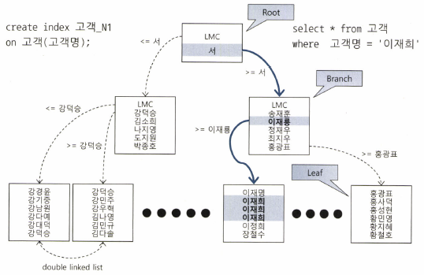

# 2. 인덱스 기본

## 2.1 인덱스 구조 및 탐색

### 인덱스 튜닝의 두 가지 핵심요소
인덱스는 큰 테이블에서 소량의 데이터를 검색할 때 주로 이용한다. <br>

#### 1. 인덱스 스캔 효율화 튜닝
#### 2. 테이블 엑세스 횟수 최소화
- 인덱스 스캔 후 테이블 레코드를 액세스할 때 랜덤 I/O 방식을 사용하므로 '랜덤 액세스 최소화 튜닝'을 수행한다.

두 튜닝 중 더 중요한 것은 '랜덤 액세스 최소화 튜닝'이다. 성능에 더 큰 영향을 미치기 때문이다.

### 랜덤 I/O와의 전쟁
성능개선을 위해 DBMS에서 제공하는 많은 기능은 결과적으로 랜덤 I/O를 극복하기 위해 탄생했다.

### 인덱스란
인덱스는 대용량 테이블에서 필요한 데이터만 빠르게 효율적으로 액세스하기 위해 사용하는 오브젝트이다.<br>
DBMS는 일반적으로 B+Tree 인덱스를 사용한다.



나무를 거꾸로 뒤집은 모양으로 뿌리가 위쪽에 있고 가지를 거쳐 맨 아래의 리프로 향한다.

루트와 브랜치 블록에 있는 각 레코드는 하위 블록에 대한 주소값을 갖는다. 그 사이에는 키값을 갖지 않는 특별한 레코드가 하나 있는데 `LMC`라고 하며 'Left Most Child'의 약자이다.
LMC는 자식 노드 중 가장 왼쪽 끝에 위치한 블록을 가리키며 이 블록은 해당 블록의 키값보다 작거나 같은 레코드를 가지고 있다.

리프 블록에 저장된 각 레코드는 키값 순으로 정렬돼 있을 뿐만 아니라 테이블 레코드를 가리키는 주소값인 `ROWID`를 가진다. 
인덱스 키값이 같다면 ROWID 순으로 정렬되며 이 ROWID는 데이터 블록 주소와 로우 번호로 구성되기 떄문에 테이블 레코드를 찾아갈 수 있다.

- ROWID : 데이터 블록 주소 + 로우 번호
- 데이터 블록 주소 : 데이터 파일 번호 + 블록 번호
- 블록 번호 : 데이터파일 내에서 부여한 상대적 순번
- 로우 번호 : 블록 내 순번

### 인덱스 탐색 방법
인덱스 탐색 과정은 크게 수직적 탐색, 수평적 탐색으로 나눌 수 있다.

1. 수직적 탐색
   - 수직적 탐색은 정렬된 인덱스 레코드 중 조건을 만족하는 첫 번째 레코드를 찾는 과정이다.
   - 루트 블록부터 브랜치 블록에는 하위 블록에 대한 주소값을 가지기 때문에 수직적 탐색이 가능하다.
   - 각 블록에서 조건을 검사하며 조건을 만족하는 첫 레코드가 목표 지점이다.
2. 수평적 탐색
   - 수평적 탐색은 수직적 탐색을 통해 찾은 블록에서 찾고자 하는 데이터가 더 안나타날때까지 인덱스 리프 블록을 수평적으로 스캔한다.
   - 인덱스에서 본격적으로 데이터를 찾는 과정이며 리프 블록에는 양방향 연결 리스트 구조로 앞뒤 블록에 대한 주소값을 가지고 있기 떄문에 수평적 탐색이 가능하다.
   - 필요한 컬럼을 인덱스가 모두 갖고 있어서 인덱스만 스캔하고 끝날 수도 있지만 일반적으로 인덱스를 스캔하고 테이블도 액세스한다.

### 결합 인덱스 구조와 탐색
인덱스는 두 개 이상 컬럼을 결합해서 생성할 수도 있다.

결합 인덱스를 구성할 떄 인덱스 컬럼의 순서가 바뀌더라도 읽는 인덱스 블록의 개수는 동일하며 성능 또한 동일하다.

인덱스 순서가 바뀜에 따라 성능이 바뀐다는 것은 잘못된 말이다. 인덱스 탐색 과정에 따라 달라질 수는 있지만 일반적인 DBMS에서 사용하는 B+Tree 인덱스는 그렇지 않다.
B+Tree에서 B는 'Balanced'를 의미하며 어떤 값으로 탐색하더라도 인덱스 루트에서 리프 블록에 도달하기까지 읽는 블록수가 같음을 의미한다. 즉, 루트로부터 모든 리프 블록까지의 높이는 항상 같다.

## 2.2 인덱스 기본 사용법

"인덱스 컬럼을 가공하면 인덱스를 정상적으로 사용(Range Scan)할 수 없다."

모든 SQL 튜닝에서 다루는 내용이며 기본 중에 기본이다. 그 이유는 인덱스 스캔 시작점음 찾을 수 없기 때문이다.<br>

> ### OR Expansion
> - OR 조건은 인덱스를 사용할 수 없지만 Union All로 변경하면 인덱스를 사용할 수 있다.
> - 이유는 각 브랜치 별로 인덱스 스캔 시작점을 찾을 수 있기 때문이다.

Or 절을 In 절로 바꾸더라도 인덱스를 사용할 수 없다. In 절은 OR 절과 동일한 처리 방식을 사용하기 때문이다.

따라서 SQL 옵티마이저는 In 조건절에 대해 IN-LIST ITERATOR 방식을 사용한다. 이 방식을 통해 In-List 개수만큼 Index Range Scan을 반복하여 Union All로 변환한 것과 동일한 효과를 얻는다.

### 인덱스 사용 조건
Index Range Scan을 위한 가장 첫 번째 조건은 인덱스 선두 컬럼이 가공하지 않은 상태로 조건절에 있어야 한다는 것이다.
이는 역으로 말하면 인덱스 선두 컬럼이 가공되지 않은 상태로 조건절에 있으면 Index Range Scan을 사용할 수 있다는 것이다.

```sql
인덱스 : (기준연도, 기준월, 보고회차)

select * from emp
where 기준연도 = 2021
and substr(기준월, 1, 4) = '01'
and 보고회차 = 1;
```

이와 같은 sql은 기준월이라는 인덱스 컬럼을 가공했지만 인덱스 선두 컬럼인 기준연도를 가공하지 않고 조건절에 두었기 때문에 Index Range Scan을 사용할 수 있다.

### 인덱스를 이용한 소트 연산 생략
인덱스를 타더라도 정말 제대로 동작하는지 확인하기 위해서는 인덱스 리프 블록에서 스캔하는 양을 확인해야 한다.

인덱스는 정렬돼있기 때문에 Range Scan이 가능하고 소트 연산 생략 효과도 부수적으로 얻게 된다. 

예를 들어, PK가 "장비번호 + 변경일자 + 변경순번"으로 구성되어 있을 때, 장비번호, 변경일자로만 조회하면 결과집합은 변경순번 순으로 출력된다.
옵티마이저는 이런 속성을 활용해 SQL에 ORDER BY가 있어도 정렬 연산을 수행하지 않는다.

인덱스 리프 블록은 양방향 연결 리스트 구조이기 때문에 오름차순, 내림차순을 가리지 않고 모두 정렬이 가능하다.

### ORDER BY 절에서 컬럼 가공

"인덱스 컬럼을 가공하면 인덱스를 정상적으로 사용할 수 없다"에서 말하는 인덱스 컬럼은 조건절에 사용한 컬럼을 말한다. 하지만 조건절이 아닌 ORDER BY 또는 SELECT-LIST 절에서 컬럼을 가공함으로써 인덱스를 정상적으로 사용할 수 없는 경우도 종종 있다.
```sql
SELECT *
FROM (
    SELECT TO_CHAR(기준일자, 'YYYY-MM-DD') AS 기준일자, A.주문번호
    FROM 주문 A
    WHERE A.주문번호 = '20210101'
    ORDER BY 기준일자
     )
WHERE ROWNUM <= 10;
```

위의 식의 실행계획을 보면 SORT ORDER BY 옵션이 포함되어 있다.
이유는 ORDER BY 절에서 가공된 컬럼을 사용했기 때문이다. 따라서 인덱스를 정상적으로 사용하기 위해서는 ORDBY 절의 기준일자를 A.기준일자로 변경해야 한다.

### SELECT-LIST에서 컬럼 가공
SELECT-LIST에서 컬럼을 가공하면 인덱스를 정상적으로 사용할 수 없다.
```sql
SELECT NVL(TO_NUMBER(변경순번)), 0)
FROM 상태변경이력
WHERE 장비번호 = 'C'
AND 변경일자 = '20210101'
```
이와 같은 SQL은 정렬 연산을 생략할 수 없다. 
인덱스에는 문자열 기준으로 정렬돼 있는데 이를 숫자값으로 가공한 값을 기준으로 최종 변경순번을 요구했기 때문이다.

이는 다음과 같이 변경하면 정렬 연산 없이 최종 변경순번을 쉽게 찾을 수 있다.
```sql
SELECT NVL(TO_NUMBER(MAX(변경순번)), 0)
FROM 상태변경이력
WHERE 장비번호 = 'C'
AND 변경일자 = '20210101'
```
하지만 애초에 변경순번 데이터를 숫자형으로 설계했다면 이러한 튜닝 자체가 필요없어진다. 가공하는 과정이 필요없어지기 때문이다.

### 자동 형변환
인덱스 컬럼과 조건절의 컬럼이 자료형이 다르면 옵티마이저가 인덱스 컬럼에 형변환을 시도하여 인덱스를 사용하지 못할 수 있다.
DBMS마다 다르지만 오라클의 경우 자동으로 형변환을 시도한다.
```sql
SELECT * FROM 고객
WHERE 고객번호 = '19980516';
```
옵티마이저는 위의 쿼리를 다음과 같이 변경한다.
```sql
SELECT * FROM 고객
WHERE TO_NUMBER(고객번호) = 19980516;
```
결과적으로 인덱스 컬럼이 가공되었기 때문에 Index Range Scan이 불가능해진다.

- 숫자형 > 문자형
- 날짜형 > 문자형

하지만 연산자가 LIKE 일때는 다르다. LIKE 자체가 문자열 비교 연산자이기 때문에 문자형 기준으로 숫자형 컬럼이 변환된다.

### 자동 형변환 시 주의사항
decode 함수를 처리할 때 내부에서 사용하는 자동 형변환을 주의해야 한다.
`decode(a,b,c,d)`를 처리할 때, a=b이면 c를 반환하고 아니면 d를 반환한다. 이 때, 반환값의 데이터 타입은 세 번째 인자인 c에 의해 결정된다.

따라서 c가 문자형이고 d가 숫자형이면 d는 문자형으로 변환된다. 또한, c가 null이면 varchar2로 취급한다.

이를 해결하기 위해서는 데이터 타입을 명시적으로 일치시켜 주거나 NULL값을 처리해주면 된다.

이러한 이유를 바탕으로 튜닝을 위해서는 자동 형변환에 의존해서는 안 된다.

### 2.3 인덱스 확장기능 사용법
#### Index Range Scan
Index Range Scan은 B+Tree 인덱스에서 가장 일반적이고 정상적인 형태의 액세스 방식이다.
수직적 탐색 이후 필요한 범위에 수평적 탐색을 실시한다.<br>
선두 컬럼을 가공하지 않은 상태로 조건절에 사용해야 한다.

#### Index Full Scan
수직적 탐색없이 인덱스 리프 블록을 처음부터 끝까지 수평적으로 탐색하는 방식이다.<br>
대개 데이터 검색을 위한 최적의 인덱스가 없을 때 차선으로 선택된다.

인덱스 선두 컬럼이 조건절에 없을 때 옵티마이저는 먼저 Table Full Scan을 고려한다. 테이블의 크기보다 인덱스의 크기가 더 작을 때에는 인덱스를 풀로 스캔하는 것이 더 비용이 싸다.

Index Full Scan을 하면 Range Scan과 마찬가지로 결과집합이 인덱스 컬럼 순으로 정렬된다. 따라서 Sort Order By 연산을 생략할 목적으로도 사용할 수 있다.

#### Index Unique Scan
수직적 탐색만으로 데이터를 찾는 스캔 방식으로서,, Unique 인덱스를 '='조건으로 탐색하는 경우에 작동한다.

Unique 인덱스라고 모두 Index Unique Scan이 되는 것은 아니며 범위 조건으로 검색할 때에는 Index Range Scan으로 처리된다. <br>
또한, Unique 결합 인덱스에 대해 일부 컬럼만으로 검색할 때도 Index Range Scan이 나타난다.

#### Index Skip Scan
인덱스 선두 컬럼을 조건절에 사용하지 않으면 옵티마이저는 기본적으로 Table Full Scan을 선택한다. 시간이 지나면서 오라클은 인덱스 선두 컬럼이 조건절에 없어도 인덱스를 활용하는 새로운 스캔방식으로 9i 버전에서 Index Skip Scan을 도입했다.

Index Skip Scan은 루트 또는 브랜치 블록에서 읽은 컬럼 값 정보를 이용해 조건절에 부합하는 레코드를 포함할 가능성이 있는 리프 블록만 골라서 액세스하는 스캔 방식이다.<br>
조건절에 빠진 인덱스 선두 컬럼의 Distinct Value 개수가 적고 후행 컬럼의 Distinct Value 개수가 많을 때 유용하다.

선두 컬럼에 대한 조건절은 있고 중간 컬럼에 대한 조건절이 없을 경우에도 Index Skip Scan이 발생할 수 있다.<br>
또한, 선두 컬럼이 부등호, BETWEEN, LIKE 등의 범위 조건을 가지고 있을 때에도 Index Skip Scan이 발생할 수 있다.

#### Index Fast Full Scan
논리적인 인덱스 트리 구조를 무시하고 인덱스 세그먼트 전체를 Multiblock I/O 방식으로 스캔하는 방법이다.

속도는 빠르지만 인덱스 리프 노드가 갖는 연결 리스트 구조를 무시한 채 데이터를 읽기 때문에 결과집합이 인덱스 키 순서대로 정렬되지 않는다.<br>
또한, 쿼리에 사용한 컬럼이 모두 인덱스에 포함돼 있을 때만 사용할 수 있다는 점도 기억해야 한다.

#### Index Range Scan Descending
인덱스를 역순으로 스캔하는 방법이다. 오라클 11g부터 지원한다.


