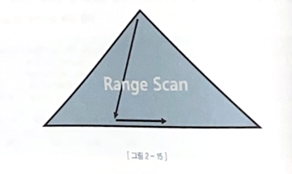
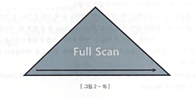
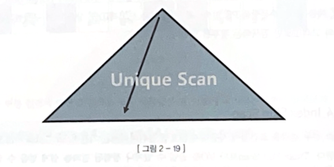
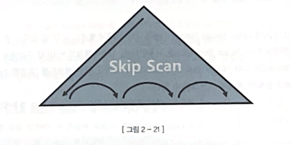
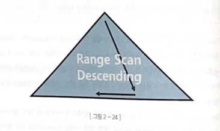

# 2장 : 인덱스 기본

## 1. 인덱스 구조 및 탐색

대게 데이터를 찾는 경우 기법에는 두가지가 있다.

1. 테이블 전체 스캔
2. 인덱스 이용

특히 OLTP(Oline Traction Processing) 시스템은 특히 소량 검색이 중요하여 튜닝이 중요하다.

### 인덱스 튜닝방법

1. 인덱스 스캔 효율화 튜닝 (특정 기준으로 정렬 하는 것과 같은 방법)
2. **테이블 액세스 횟수를 줄인다. ( 랜덤 액세스 최소화 튜닝) ⇒ 이게 더 중요하다.**

SQL 튜닝은 랜덤 I/O와의 전쟁이다.

인덱스를 이용하면 일부만 읽을 수 있다. (범위 스캔 가능)

DBMS는 일반적으로 B*Tree를 사용한다.

### 인덱스 탐색 과정 : 수직적 탐색 + 수평적 탐색

1. 수직적 탐색  : 인덱스 스캔 시작 지점을 찾는다
2. 수평적 탐색 : 데이터를 찾는다
    1. 조건절을 모두 만족하는 데이터를 찾는다
    2. 나중에 테이블 접근했을때를 대비한 RowId를 얻기 위해

인덱스는  엑셀과 같은 평면적인 구조가 아니다.

## 2. 인덱스 기본 사용법

`인덱스 컬럼을 가공하면 인덱스를 정상적으로 사용할 수 없다.`

⇒ 인덱스 스캔의 시작점을 찾을 수 없어서, 이렇게 하면 인덱스를 Range Scan 할수가 없다.

⇒ like연산도 앞에서 부터 시작하는것에서는 가능하지만 중간에 있는것을 찾는경우에는 인덱스가 의미가 없다.

인덱스를 Range Scan 하기 위한 가장 첫 번째 조건은 인덱스 선두 컬럼이 조건절에 있어야 한다는 사실이다.

⇒ 인덱스를 선두 컬럼이 가공되지 않은 상태로 조건절에 있으면 인덱스 Range Scan은 가능하다.

단순히 인덱스 잘 탄다고 튜닝이 끝나는것이 아니라 실제 스캔하는 데이터의 양을 확인해야 한다.

인덱스를 RangeScan할 수 있는 이유는 sort가 되어 있기 때문이다 .

인덱스로 sort 연산을 생략 함으로써 성능을 높일 수 있다.  ⇒ 이때도 가공되어있으면 사용이 불가하다.

옵티마이저는 별도의 정렬 연산을 따로 수행하지 않는다. 수직적 탐색을 하여 조건을 만족하는 가장 왼쪽 지점으로 내려가서 찾는다. 최솟값은 내려가서 가장 왼쪽 최댓값을 가장 오른쪽으로 가서 탐색한다.

인덱스 컬럼을 가공하면 SQL성능이 더 안 좋아질 수 있다.

자동 형변환에 의존하지 않고 인덱스 컬럼 기준으로 반대편 컬럼 또는 값을 정확히 형변화 해주서야 한다.

SQL성능 원리를 잘 모르는 경우 함수를 의도적으로 생략하곤 하는데 이 함수를 생략하는것 보다는 I/O를 줄이는것이 중요하다.

## 3. 인덱스 확장기능 사용법

### Index Range Scan
  

수직적으로 탐색하고 필요한 범위만 스캔한다.

성능은 인덱스 스캔범위, 테이블 액세스 횟수를 얼마나 줄일 수 있느냐로 결정된다.

### Index Full Scan
  
수직적 탐색 없이 인덱스 리프 블록을 처음부터 수평적으로 탐색하는것

옵티마이저는 인덱스 풀스캔을 하기에 데이터에 부담이 없으면 인덱스 활용을 고려하지 않고 인덱스 풀 스캔을 선택한다.

경우에 따라 range scan보다 full scan이 효율적일 수 있다.

### Index Unique Scan
  
= 조건으로 탐색하는 경우에 작동한다.

### Index Skip scan
  
인덱스 선두 컬럼을 조건절에 사용하지 않으면 기본적으로 풀스캔을 선택한다. 테이블 풀 스캔보다 I/O를 줄일 수 있거나 정렬된 결과를 얻을 수 있는경우 Index Full Scan을 사용하기도 한다.

그 중 Index Skip Scan은 루트 또는 브랜치 블록에서 읽은 컬럼 값 정보를 이용해 조건절에 부합하는 레코드를 포함할 가능성이 있는 리프 블록만 골라서 액세스 스캔하는 방식이다.

해당 스캔 방식이 작동하기 위해서는 선두 컬럼의 분산도가 낮고 후행컬럼에 대한 분산도가 큰경우 or 선두 컬럼의 조건절은 있지만 중간절에 대한 조건이 없는 경우에 사용된다.

인덱스 레이지 스캔이 불가능 하거나 효율적이지 못한 상황에서 빛을 발한다.

### Index Fast Full Scan
  
Index full scan보다 빠르다. 논리적인 인덱스 트리구조를 무시하고 인덱스 세그먼트 전체를 Multiblock I/O방식으로 스캔하기 때문이다.  이렇게 함으로써 디스크로부터 대량의 인덱스 블록을 읽어야 할때 큰 효과를 발휘한다. 속도는 빠르지만 인덱스 리프노드가 갖는 연결 리스트 구조를 무시한 채 데이터를 읽어서 결과 집합이 인덱스 키 순서로 정렬되지 않는다. 쿼리에 사용한 컬럼이 모두 인덱스에 포함돼있을때만 사용할 수 있다. 인덱스가 파티션 되어있지 않더라도 병렬 쿼리가 가능하다.

### Index Range Scan Descending
  
Index Range Scan과 기본적으로 동일한 스캔방식이지만 인덱스를 뒤에서 앞으로 스캔하는 방식이다.

인덱스가 있는 컬럼이라면 옵티마이저가 알아서 인덱스를 거꾸로 읽는 실행 계획을 수립한다. 만약 거꾸로 읽지 않으면 인덱스 힌트를 이용해 유도할 수 있다. `index_desc`