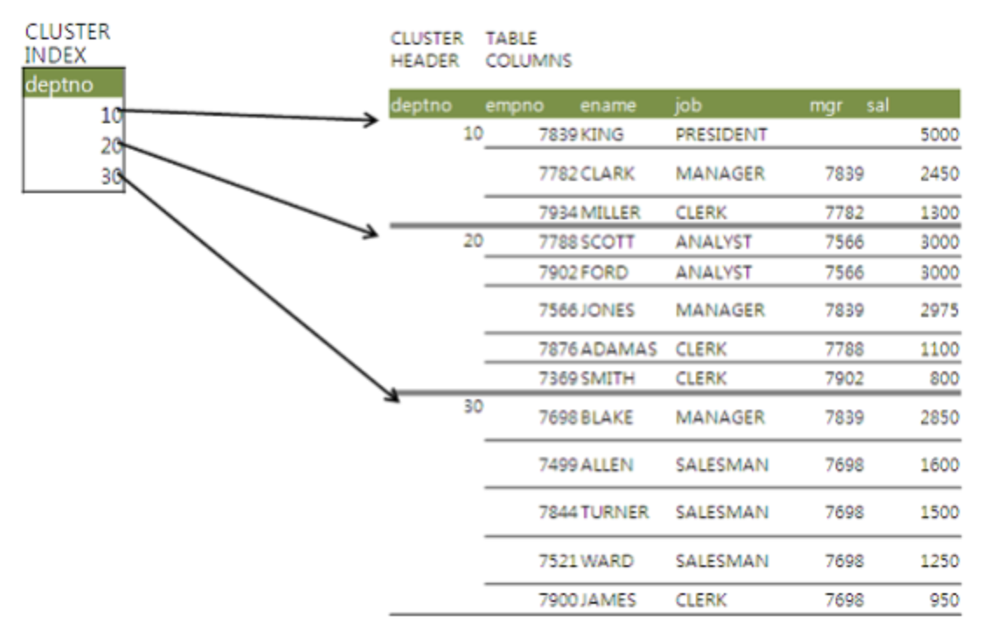

# 인덱스 튜닝

## 테이블 액세스 최소화

### 테이블 랜덤 액세스

**인덱스에 대한 맹신 또는 섣부른 자신감**

- 인덱스로 검색해도 빠른데 왜 굳이 파티셔닝을 할까 혹은 인덱스로 검색하는데 왜 느릴까?
- 대량 데이터를 조회할 때 인덱스를 사용하니 테이블 전체를 스캔할 때보다 훨씬 느림

**인덱스 ROWID는 물리적 주소? 논리적 주소?**

- 인덱스를 스캔하는 이유: 검색 조건을 만족하는 소량의 데이터를 인덱스에서 빨리 찾고 거기서 테이블 레코드를 찾아가기 위한 주소값인 ROWID를 얻으려고
- 물리적 주소 관점: ROWID는 데이터파일 번호, 오브젝트 번호, 블록 번호 같은 물리적 요소로 구성
- 논리적 주소 관점: ROWID는 물리적으로 직접 연결되지 않고 테이블 레코드를 찾아가기 위한 논리적 주소 정보를 담고 있음
- ROWID는 포인터와 다름
- 디스크 상에서 테이블 레코드를 찾아가기 위한 위치 정보를 담음

**메인 메모리 DB와 비교**

- 메인 메모리 DB (MMDB): 데이터를 모두 메모리에 로드해 놓고 메모리를 통해서만 I/O를 수행하는 DB
    - 인스턴스를 기동하면 디스크에 저장된 데이터를 버퍼캐시로 로딩하고 이어서 인덱스 생성
    - 인덱스가 메모리 상의 주소 정보, 포인터를 가지게 됨
    - 인덱스를 경유해 테이블을 액세스하는 비용이 매우 낮음
- OLTP DB
    - 테이블 블록이 수시로 버퍼 캐시에서 밀려났다가 다시 로딩되었다가 함
    - 따라서 그때마다 다른 공간에 캐싱되기 때문에 인덱스에 포인터 값을 저장할 수 없음
    - 메모리 주소 정보가 아닌 디스크 주소 정보 (DBA, Data Block Address)를 이용해 해시 알고리즘으로 버퍼 블록 찾음

**I/O 매커니즘 복습**

- DBA: 데이터 파일 번호 + 블록 번호로 구성된 디스크 상에서 블록을 찾기 위한 주소 정보
- ROWID에 저장된 DBA 주소를 해시 함수에 입력
- 해시 체인을 따라 버퍼 헤더를 찾음
- 버퍼 헤더는 실제 데이터가 담긴 매번 다른 버퍼 블록의 위치를 가지고 있음
- 버퍼 헤더에서 얻은 포인터로 버퍼 블록을 찾아감
- 만약 버퍼 캐시에서 못 읽으면 디스크에서 블록을 읽음

**인덱스 ROWID는 우편 주소**

- ROWID는 우편 주소, 포인터는 전화번호
- 전화 통신은 물리적으로 연결되었지만 우편 통신은 우편 봉투에 적힌 대로 우체부 아저씨가 일일이 찾아다니는 구조

### 인덱스 클러스터링 팩터

- 클러스터링 팩터: 특정 컬럼을 기준으로 같은 값을 갖는 데이터가 서로 모여 있는 정도
- CF가 좋은 컬럼에 생성한 인덱스는 검색 효율이 좋음
- 예를 들어 [거주지역 = ‘제주’]인 데이터들이 물리적으로 근접해 있으면 흩어져 있을 때보다 데이터 찾는 속도가 빠름

### 인덱스 손익분기점

- Index Range Scan에 의한 테이블 액세스가 Table Full Scan보다 느려지는 지점
- 인덱스 스캔이 계속 느려지는 이유
    - Table Full Scan은 시퀀셜 액세스인 반면, 인덱스 ROWID 테이블 액세스는 랜덤 액세스 방식
    - Table Full Scan은 Multiblock I/O인 반면, 인덱스 ROWID 테이블 액세스는 Singleblock I
- 인덱스 스캔이 항상 좋을 수는 없을 뿐이지 테이블 스캔을 피하기 위해 조치를 취해야 하는 것은 아님

**온라인 프로그램 튜닝 vs 배치 프로그램 튜닝**

- 온라인 프로그램 튜닝
    - 소량 데이터를 읽고 갱신하므로 인덱스를 효과적으로 활용하는 것이 중요
    - NL 조인 사용 (인덱스 사용하는 조인 방식)
- 배치 프로그램 튜닝
    - 전체 범위 처리 기준으로 튜닝
    - 처리대상 집합 중 일부를 빠르게 처리하는 것이 아닌 전체를 빠르게 처리해야 함
    - Full scan과 해시 조인이 유리

### 인덱스 컬럼 추가

- 테이블 액세스 최소화를 위해 가장 일반적으로 사용하는 튜닝 기법
- 실무에서 인덱스 구성을 변경하기란 어렵기 때문에, 기존 인덱스에 새로운 칼럼을 더해 인덱스를 새로 만드는 방법
- 테이블마다 인덱스가 수십 개씩 달려 배보다 배꼽이 더 커지면 안 됨
    - 인덱스 관리 비용이 증가하고 DML 부하에 따른 트랜잭션 성능 저하 발생 위험
- 인덱스 스캔량이 아닌 테이블 랜덤 액세스 회수를 줄여 줌

### 인덱스만 읽고 처리

```sql
SELECT 부서번호, SUM(수량)
FROM 판매집계
WHERE 부서번호 LIKE '12%'
GROUP BY 부서번호;
```

- 만약 인덱스가 부서번호로 구성되어 있다면, 인덱스를 통해 발생하는 비효율은 없음
- 하지만 인덱스에 해당하는 데이터에 하나하나 랜덤 액세스를 해야 해서 일은 많기에 속도가 느림
- 인덱스 자체에 수량까지 추가해서 인덱스만 읽고 테이블 액세스 제거
- `Covered 쿼리`: 인덱스만 읽어서 처리하는 쿼리
- `Covered 인덱스`: 그 쿼리에 사용한 인덱스

**Include 인덱스**

```sql
CREATE INDEX emp01 ON emp (deptno) INCLUDE (sal);
CREATE INDEX emp02 ON emp (deptno, sal);
```

- emp01은 sal 칼럼을 리프 블록에만 저장해서 수직적 탐색에는 deptno만 사용하고 수평적 탐색에는 sal도 사용 가능
- emp02 deptno와 sal 모두 루트 브랜치 블록에 저장하고 둘 다 수직적 탐색에 활용

```sql
SELECT sal FROM emp WHERE deptno = 20;
```

- 위 쿼리를 실행할 때 emp01, emp02 모두 Covered 인덱스로 테이블 액세스 제거 가능

```sql
SELECT * FROM emp WHERE deptno = 20 order by sal;
```

- emp01 인덱스는 정렬 연산 생략 불가능, emp02 인덱스는 정렬 연산 생략 가능
- Include는 순전히 테이블 랜덤 액세스를 줄이는 용도로 개발됨

### 인덱스 구조 테이블

- IOT(Index Organized Table): 랜덤 액세스가 아예 발생하지 않도록 테이블을 인덱스 구조로 생성하는 것
- 테이블을 찾아가기 위한 ROWID를 가지는 일반 인덱스와 달리 IOT는 그 자리에 테이블 데이터를 가짐
- 테이블 블록에 있어야 할 데이터를 인덱스 리프 블록에 모두 저장
- 인덱스 리프 블록이 곧 데이터 블록

```sql
CREATE TABLE index_org (a number, b varchar(10) ...)
ORGANIZATION INDEX;
```

### 클러스터 테이블

**인덱스 클러스터 테이블**


- 클러스터 키 값이 같은 레코드를 한 블록에 모아서 저장하는 구조
- 한 블록에 모두 담을 수 없을 때는 새로운 블록을 할당해 클러스터 체인으로 연결
- 다중 테이블 클러스터: 여러 테이블 레코드를 같은 블록에 저장
- 인덱스 클러스터 테이블을 구성하려면 아래와 같이 클러스터를 생성하고 클러스터에 테이블을 담기 전에 인덱스 반드시 정의

```sql
CREATE CLUSTER c_deptno# (deptno number(2)) INDEX;
```

```sql
CREATE INDEX i_deptno# on cluster c_deptno#;
```

- 일반 인덱스 레코드는 테이블 레코드와 1:1 관계지만 클러스터 인덱스는 테이블 레코드와 1:N 관계
- 클러스터 인덱스의 키 값은 항상 Unique

**해시 클러스터 테이블**

- 해시 클러스터는 인덱스를 사용하지 않고 해시 알고리즘을 사용해 클러스터를 찾아감
- 해시 클러스터 테이블을 구성하려면 클러스터 생성

```sql
CREATE CLUSTER c_deptno# (deptno number(2)) HASHKEYS 4;
```

## 부분 범위 처리 활용

### 부분 범위 처리

- DBMS가 클라이언트에게 데이터를 전송할 때 일정량씩 나누어서 전송
- 아직 전송하지 않은 분량이 많이 남아 있어도 서버 프로세스는 클라이언트로부터 추가 Fetch call을 받기 전까지 멈춰서 기다림
- 대용량 데이터도 빠르게 출력할 수 있는 이유: DBMS가 데이터를 모두 읽어 한 번에 전송하지 않고 먼저 읽는 데이터부터 일정량을 전송하고 멈추기 때문
- 부분 범위 처리: 쿼리 결과 집합을 쉼 없이 연속적으로 전송하지 않고 사용자로부터 Fetch Call이 있을 때마다 일정량씩 나누어 전송하는 것
- Array Size가 10일 때 데이터를 읽는 매커니즘
    1. 최초 호출 시 Fetch Call을 통해 DB 서버로부터 전송받은 데이터 10 건을 클라이언트 캐시에 저장
    2. 이후 호출에 Fetch Call을 발생시키지 않고 캐시에서 데이터 읽음
    3. 캐시에 저장한 데이터를 모두 소진한 상태에서 호출하면 추가 Fetch Call을 통해 다음 10 건을 전송받음

**정렬 조건이 있을 때 부분 범위 처리**

- 정렬이 있다면 모든 데이터를 읽어 정렬을 마치고서야 클라이언트에게 데이터 전송 가능 → 전체 범위 처리
- 정렬 조건이 선두인 인덱스가 있으면 부분 범위 처리 가능

**Array Size 조정을 통한 Fetch Call 최소화**

- 대량 데이터를 파일로 내려받을 때
    - 데이터를 모두 전송해야 하기에 값 크게 설정
    - Fetch Call 횟수 감소
- 앞쪽 일부 데이터만 읽을 때
    - Array Size 작게 설정
    - 불필요하게 많은 데이터 전송하는 것 방지

### OLTP 환경에서 부분 범위 처리에 의한 성능 개선 원리

- OLTP: Online Transaction Processing
- 항상 소량의 데이터만 조회하는 것은 아님
- 은행 계좌 입출금 조회, 게시판 조회 등은 앞쪽 일부 데이터만 빠르게 읽음
- 앞쪽 일부만 출력하고 멈출 수 있는지가 부분 범위 처리의 핵심
- n-Tier 환경에서는 클라이언트가 특정 DB 커넥션을 독점할 수 없어서 부분 범위 처리가 어려울 수 있음

## 인덱스 스캔 효율화

### 인덱스 스캔 효율성

| 성 | 능 | 감 | 시 |
| --- | --- | --- | --- |
| 성 | 능 | 개 | 량 |
| 성 | 능 | 개 | 선 |
| 성 | 능 | 검 | 사 |
| 성 | 능 | 검 | 증 |
| 성 | 능 | 계 | 수 |
| 성 | 능 | 계 | 측 |
| 성 | 능 | 곡 | 선 |
| 성 | 능 | 관 | 리 |
| 성 | 능 | 시 | 험 |
| 성 | 능 | 이 | 론 |
| 성 | 능 | 지 | 수 |
| 성 | 능 | 측 | 정 |
| 성 | 능 | 튜 | 닝 |
| 성 | 능 | 평 | 가 |
| 성 | 능 | 호 | 환 |

**‘성능검’으로 시작하는 용어를 검색할 때**

- 성능검사, 성능검증까지만 조사하면 됨
- 성능검으로 시작하는 단어가 더 없음을 확인하기 위해 성능계수까지 읽음
- 총 세 개의 단어 확인

**‘성능’으로 시작하고 네 번째 단어가 ‘선’인 단어 검색할 때**

- 테이블 전체 스캔이 필요

| C1 | C2 | C3 | C4 |
| --- | --- | --- | --- |
| 성 | 능 | 감 | 시 |
| 성 | 능 | 개 | 량 |
| 성 | 능 | 개 | 선 |
| 성 | 능 | 검 | 사 |
| 성 | 능 | 검 | 증 |
| 성 | 능 | 계 | 수 |
| 성 | 능 | 계 | 측 |
| 성 | 능 | 곡 | 선 |
| 성 | 능 | 관 | 리 |
| 성 | 능 | 시 | 험 |
| 성 | 능 | 이 | 론 |
| 성 | 능 | 지 | 수 |
| 성 | 능 | 측 | 정 |
| 성 | 능 | 튜 | 닝 |
| 성 | 능 | 평 | 가 |
| 성 | 능 | 호 | 환 |

**‘성능검’으로 시작하는 레코드 검색할 때**

- 인덱스 수직적 탐색을 통해 성능검사부터 찾음
- 성능검증, 성능계수까지 읽고 성능검으로 시작하는 단어가 더 없음을 확인
- 총 세 개의 데이터 읽음

**‘성능’으로 시작하고 네 번째 단어가 ‘선’인 단어 검색할 때**

- ‘성능’으로 시작하는 모든 데이터를 다 읽음
- 인덱스 선행 컬럼이 조건절에 없기 때문
- 즉 C4 인덱스보다 앞선 선행 컬럼 C3 인덱스가 조건절에 없기 때문 → 비효율 발생

### 액세스 조건과 필터 조건

- 액세스 조건: 인덱스 스캔 범위를 결정하는 조건절
- 필터 조건: 테이블로 액세스할지를 결정하는 조건절

### 비교 연산자 종류와 컬럼 순서에 따른 군집성

- 인덱스에는 같은 값을 갖는 레코드들이 서로 군집해 있음
- 인덱스 컬럼을 앞쪽부터 누락 없이 ‘=’ 연산자로 조회하면 조건절을 만족하는 레코드가 모두 모여 있음
- 첫 번째 나타나는 범위 검색 조건까지만 만족하는 인덱스는 모두 모여 있지마느 그 이하 조건까지 만족하는 레코드는 비교 연산자 종류에 관계없이 흩어져 있음

### 인덱스 선행 컬럼이 등차(=)조건이 아닐 때 생기는 비효율

- 인덱스 스캔 효율성은 인덱스 컬럼을 조건절에 모두 등치로 사용할 때 가장 좋음
- 인덱스 선행 컬럼이 모두 등치 조건일 때 필요한 범위만 스캔하고 멈출 수 있는 것은 조건을 만족하는 레코드가 모두 모여 있기 때문
- 다른 연산자를 사용하면 흩어져 있는 레코드들에 랜덤 액세스를 반복하며 비효율 발생