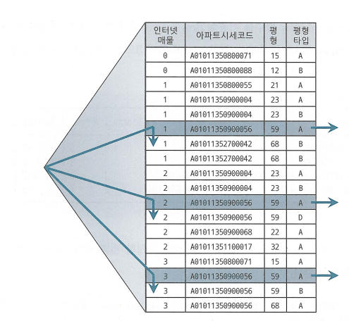

## 3.3 인덱스 스캔 효율화

### 액세스 조건과 필터 조건
액세스를 스캔하는 단계에서 처리하는 조건절은 액세스 조건과 필터 조건으로 나뉜다.

- 액세스 조건 : 인덱스 스캔 범위를 결정하는 조건절
- 필터 조건 : 쿼리 수행 다음 단계로 전달하거나 최종 결과집합에 포함할지를 결정하는 조건절

### 비교 연산자 종류와 컬럼 순서에 따른 군집성ㅇ
부등호, BETWEENm LIKE, IN 등의 비교 연산자를 사용할 때 인덱스의 컬럼 순서에 따라 인덱스 스캔 효율이 달라진다. <br>
비교 연산자를 사용하면 조건절을 만족하는 레코드가 서로 흩어진 상태가 된다.

### 인덱스 선행 컬럼이 등치(=)이 아닐 때 생기는 비효율
인덱스 스캔 효율성은 인덱스 컬럼을 조건절에 모두 등치조건으로 사용할 때 가장 좋다.<br>
등치 조건을 통해 리프 블록을 스캔하여 읽은 레코드는 모두 테이블 액세스로 이어지므로 인덱스 스캔 단게에서의 비효율이 없기 때문이다.

인덱스 컬럼 중 일부가 조건절에 없거나 등치 조건이 아니더라도 그것이 뒤쪽 컬럼일 때는 비효율이 없다.

반면, 인덱스 선행 컬럼이 조건절에 없거나 범위검색 조건이면 인덱스를 스캔하며 비효율이 생긴다. <br>
그렇지만 Between과 같이 범위검색의 시작 조건을 탐색할 때에는 해당 컬럼의 모든 레코드를 읽지 않고 조건에 맞는 컬럼에서부터 탐색을 시작한다.

### Between을 In-List로 전환
범위검색 컬럼을 인덱스의 맨 뒤로 가도록 설정하는 것이 가장 좋겠지만 운영 시스템에서 인덱스 구성을 바꾸기는 쉽지 않기 때문에 Between을 In-List로 전환하는 방법을 사용할 수 있다.



Between을 In-List로 전환하면 인덱스를 List의 길이만큼 반복해서 읽게 되는데 각 원소별로 등치조건으로 탐색하기 때문에 비교적 효율적이다. <br>
In-List의 개수만큼 Union-All 브랜치가 생성되고 각 컬럼을 등치조건으로 검색하는 것이다.

이는 Index Skip Scan으로 유도해도 비슷한 효과를 얻을 수 있다.<br>

만약 In-List의 항목 개수가 늘어날 수 있다면 이 방식은 사용하기 어렵다. <br>
그때는 NL 방식의 조인문이나 서브쿼리로 구현하면 된다.

In-List로 바꾸는 방법은 레코드들이 서로 멀리 떨어져 있을 때만 유용하다. <br>
만약 레코드들이 서로 가깝게 분포되어 있다면 연속적으로 읽는 것이 더 효율적일 수 있다.

### Index Skip Scan 활용
In-List로 전환하는 것처럼 조건절을 수정하지 않고 Index Skip Scan을 사용하여 비슷한 효과를 낼 수도 있다.

### In 조건은 = 인가
결과적으로 In 조건은 = 조건과 다르다. <br>
```sql
SELECT *
FROM 고객별가입상품
WHERE 고객번호 = :cust_no
AND 상품ID in (1, 2, 3);
```

위 쿼리에 대한 인덱스를 [상품ID + 고객번호], [고객번호 + 상품ID]로 생성하는 경우 성능은 차이가 생긴다.<br>
인덱스가 상품ID + 고객번호로 구성되는 경우 In-List Iterator 방식으로 풀리게 된다. 하지만 고객번호 + 상품ID로 구성되는 경우
같은 고객은 상품ID 순으로 정렬된 상태로 같은 리프 블록에 저장된다.

### NUM_INDEX_KEYS 힌트
In-List를 액세스 조건 또는 필터 조건으로 유도하는 방법은 NUM_INDEX_KEYS 힌트를 사용하는 것이다. <br>
```sql
SELECT /*+ NUM_INDEX_KEYS(고객별가입상품 3) */
FROM 고객별가입상품
WHERE 고객번호 = :cust_no
```
위의 SQL의 의미는 고객별가입상품 테이블의 인덱스를 3개의 컬럼을 사용하여 인덱스 스캔을 하라는 것이다. <br>

### BETWEEN과 LIKE 스캔 범위 비교
LIKE와 BETWEEN 모두 범위검색 조건으로서 비효율이 발생하지만 데이터 분포와 조건절 값에 따라 인덱스 스캔량이 다를 수 있다.<br>
결과적으로는 LIKE보다 BETWEEN을 사용하는 것이 좋다.

### OR 조건 활용
OR 조건은 옵티마이저에 의한 OR Expansion 쿼리 변환이 기본적으로 작동하지 않기 때문에 옵션 조건 컬럼을 선두에 두고 인덱스를 구성해도 이를 사용할 수 없다.<br>
따라서 인덱스 선두 컬럼에 대한 옵션 조건에 OR 조건을 사용해선 안 된다.

인덱스에 포함되지 않은 컬럼에 대한 옵션 조건은 어차피 테이블에서 필터링할 수 밖에 없으므로 그럴때는 OR 조건을 사용해도 무방하다.
- 인덱스 액세스 조건으로 사용 불가
- 인덱스 필터 조건으로 사용 불가
- 테이블 필터 조건으로만 사용 가능
- 단, 인덱스 구성 컬럼 중 하나 이상이 Not Null이라면 18c부터 인덱스 필터 조건으로 사용 가능

### LIKE/BETWEEN 조건 활용
필수 조건 컬럼을 인덱스 선두에 두고 액세스 조건으로 사용하면 LIKE/BETWEEN이 인덱스 필터 조건이어도 충분히 좋은 성능을 낼 수 있다.<br>
LIKE/BETWEEN 패턴을 사용하고자 할 때는 네 가지 경우에 속하는지 반드시 점검해야 한다.

1. 인덱스 선두 컬럼
   - LIKE/BETWEEN 패턴을 사용하고자 하는 컬럼이 인덱스 선두 컬럼이면 안 된다.
   - 사용자가 만약 인덱스 선두 컬럼을 입력하지 않으면 인덱스에서 모든 데이터를 스캔하면서 옵션 조건 필터링을 하게 된다.
2. NULL 허용 컬럼
   - NULL 허용 컬럼에 대한 옵션 조건을 LIKE/BETWEEN 연산자로 처리하는 것은 금물이다.
   - 이 경우는 성능을 떠나 결과 집합 자체에 오류가 발생한다.
3. 숫자형 컬럼
   - 숫자형이면서 인덱스 액세스 조건으로도 사용 가능한 컬럼에 대한 옵션 조건 처리는 LIKE 방식을 사용해선 안된다.
   - LIKE 연산자는 문자열 비교 연산자이기 때문에 숫자형 컬럼에 대한 비교 연산자로 사용하면 필터 조건으로 사용된다.
4. 가변 길이 컬럼
   - LIKE를 옵션 조건에 사용할 때는 컬럼 값 길이가 고정적이어야 한다.

### UNOIN ALL 활용
특정 변수에 값을 입력했는지 여부에 대한 조건 분기를 통해 최적의 쿼리를 실행하게 할 수 있다. <br>
UNION ALL 방식은 옵션 조건 컬럼도 인덱스 조건으로 사용한다.

### 함수호출부하 해소를 위한 인덱스 구성
PL/SQL 사용자 정의 함수는 개발자들이 일반적으로 생각하는 것보다 매우 느리다.
이유는 다음과 같다.
1. 가상머신 상에서 실행되는 인터프리터 언어
2. 호출 시마다 컨텍스트 스위칭 발생
3. 내장 SQL에 대한 Recursive Call 발생

- PL/SQL도 JAVA처럼 인터프리터 언어이기 때문에 Native 코드로 완전 컴파일된 내장함수에 비해 많이 느리다.
- PL/SQL 함수는 실행 시 매번 SQL 실행엔진과 PL/SQL 가상머신 사이에 컨텍스트 스위칭이 일어난다. 일반 프로그래밍 언어처럼 작은 단위로 모듈과, 공용화하는 것이 권장되지 않는 이유이다.
- PL/SQL 사용자 정의 함수의 성능을 떨어뜨리는 가장 결정적인 요소는 Recursive Call이다. PL/SQL 함수 내부 로직이 너무 복잡하지 않은 이상 조건절로 처리하면 속도가 훨씬 빨라진다.

PL/SQL 함수 호츌 힛수를 줄이는 여러 방법이 있는데 그 중 하나가 액세스 조건을 고려한 인덱스 구성이다.

## 3.4 인덱스 설계

### 스캔 효율성 이외의 판단 기준
- 수행 빈도
- 업무상 중요도
- 클러스터링 팩터
- 데이터량
- DML 부하
- 저장공간
- 관리 비용 등

이 중 가장 중요한 것은 수행 빈도이다. 수행 빈도가 높은 SQL에서 최적의 인덱스를 구성해야 한다.

NL 조인하는 두 테이블이 있을 때 Outer쪽 스캔 과정의 비효율보다 Inner쪽 스캔 과정의 비효율이 더 큰 문제가 된다.

### 소트 연산을 생략하기 위한 컬럼 추가
인덱스는 항상 정렬 상태를 유지하므로 ORDER BY, GROUP BY를 위한 소트 연산을 생략할 수 있게 해 준다. <br>
따라서 조건절에 사용하지 않는 컬럼이더라도 소트 연산을 생략할 목적으로 인덱스 구성에 포함시킴으로써 성능 개선을 도모할 수 있다.

