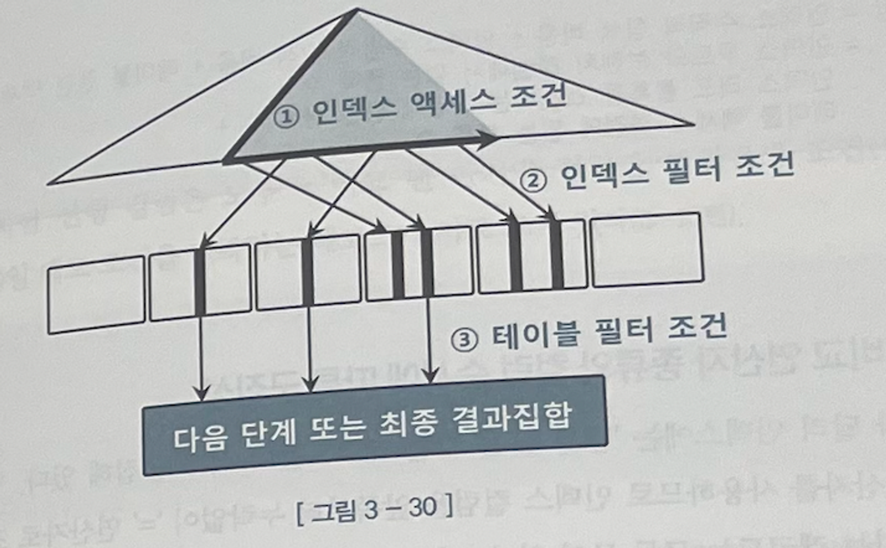
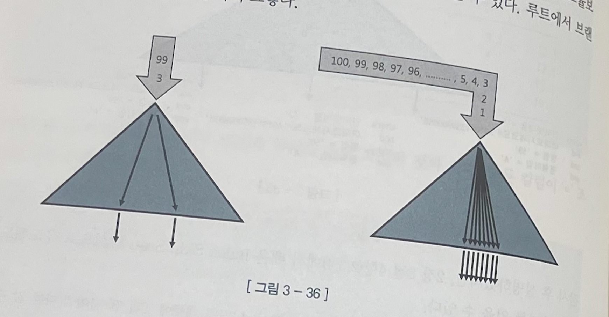
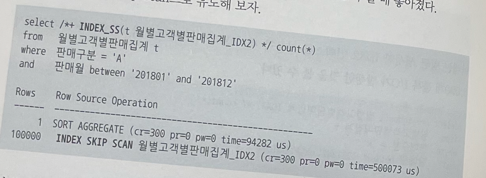
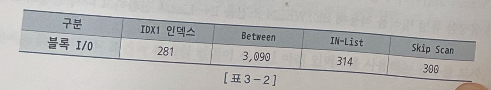
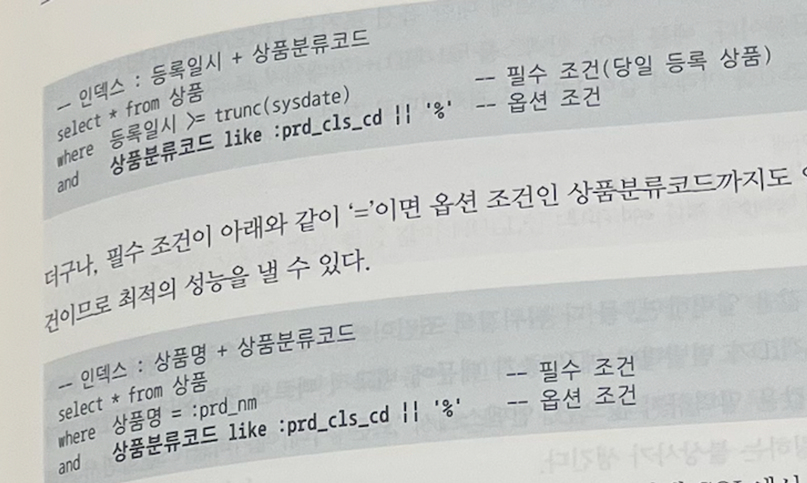

## 3. 인덱스 스캔 효율화

운영 환경에서 가능한 일반적인 튜닝 기법

인덱스 과정

LCM(LeftMost Child) : 루트 블록에 키 값을 갖지 않는 특별한 레코드

인덱스 스캔 효율성을 SQL 트레이스를 통해 알아낼 수 있다.

`엑세스 조건` :  인덱스 스캔 범위를 결정하는 조건절이다. 인덱스 수직적 탐색 을 통해 스캔 시작점을 결정하는 데 영향을 미치고, 인덱스 리프 블록을 스캔하다가 어디서 멈출지를 결정하는 데 영향을 미치는 조건절이다.

`인덱스 필터 조건` : 테이블로 엑세스할지를 결정하는 조건절이다.

`테이블 필터 조건` :  쿼리 수행 다음 단계로 전달하거나 최종 결과집합에 포함할지를 결정한다

선행 컬럼이 모두 ‘=’ 조건인 상태에서 첫 번쨰 나타나는 범위검색 조건까지만 만족하는 인덱스 레코드는 모두 연속해서 모여 있지만, 그 이하 조건 까지 만족하는 레코드는 비교 연산자 종류에 상관없이 흩어진다.

인덱스 컬럼에 대한 조건절은 모두 엑세스 조건에 표시된다. 첫 번째 나타나는 범위검색 조건 이후 조건절 컬럼은 스캔 범위를 줄이는데 큰 역할을 못하는 데도 말이다.

액세스 조건과 필터 조건을 실행계획에 표시된 대로 이해하면 사실 이 둘을 구분할 이유 가 없어진다. 따라서 실행계획에 위와 같이 표시되더라도 복잡하게 생각하지 말고, 첫 번째 나타나는 범위검색 조건까지가 인덱스 액세스 조건이고, 나머지는 필터 조건이라고 이해하자.

인덱스 스캔 효율성을 인덱스 컬럼을 조건절에 모두 동치 조건으로 사용할 때가 가장 좋다.

인덱스 컬럼 중 일부가 조건절에 없거나 동치 조건이 아니더라고 그것이 뒤쪽 컬럼일 때는 비효율시 없다.

BETWEEN IN-List로 전환할 시에는 IN-LIST의 개수가 많지 않아야 효율적이다.

Between 조건 때문에 인덱스를 비효율적으로 스캔하더라도 블록 I/0 측면에서는 대개 소량에 그치는 경우가 많다. 인덱스 리프 블록에는 테이블 블록과 달리 매우 많은 레코드가 담기기 때문이다. 게다가 IN-List 개수가 많으면 수직적 탐색 과정에서 이미 많은 블록을 읽게 된다. 데이터 분포나 수직적 탐색 비용을 따져보지도 않고 BETWEEN IN-List로 변환하는 우를 범하지 않기 바란다.

BEI WBEN 조건을 IN-List 조건으로 변환하면 도움이 되는 상황 에서 굳이 조건절을 바꾸지 않고도 같은 효과를 낼 방법이 있다.  index Skip Scan을 활용하는 것이다.

인덱스 스킵 스캔 유도 방법

  
  

선두 컬럼이 Between 이어서 나머지 검색 조건을 만족하는 데이터들이 서로 멀리 떨어져있을 때, Index Skip Scan이 유리하다.

IN 조건은 ‘=’과 동등하지 않다.

요컨데, IN 조건은 ‘=’이 아니다. In-list iterator 방식으로 풀려야만 한다. 그렇지 않으면 IN 조건은 필터 조건이다. 그렇기에 엑세스 조건으로 만들기 위해 in-list iterator 만드는 것이 유리하지는 않다. 상황에 따라 필터 방식으로 처리되는게 더 유리하다.

LIKE보다 BETWEEN 사용하는 게 낫다.

인덱스 컬럼에 범위 검색 조건을 남용 하면 인덱스 스캔 비효율이 생긴다. (데이터가 많을 수록 영향도가 크다)

OR조건 활용

- 인덱스 액세스 조건으로 사용 불가
- 인덱스 필터 조건으로도 사용 불가
- 테이블 필터 조건으로만 사용 가능

이런 특성을 고려하면 OR 조건을 이용한 옵션 조건 처리는 가급적 사용하지 않아야 한다.

필수 조건 컬림을 인덱스 선두에 두고 액세스 조건으로 사용 하면, LIKE/BETWEEN 인덱스 필터 조건이어도 충분히 좋은 성능을 내도록 할 수 있다.

이 외에도 LIKE/BETWEEN 패턴을 사용하고자 할 때는 아래 네 가지 경우에 속하는지 반드 시 점검해야 한다. (BETWEEN 조건은 1번과 2번 조건에 해당하는지만 점검하면 된다.)

1. 인덱스 선두 컬럼
2. NULL 허용 컬럼
3. 숫자형 컬럼
4. 가변 길이 컬럼

## 4. 인덱스 설계

인덱스가 많으면 생기는 문제

- DML 성능 저하(→  TPS 저하)
- 데이터베이스 사이즈 증가(→  디스크 공간 낭비)
- 데이터베이스 관리 및 운영 비용 상승

인덱스는 정렬 상태를 유지해야한다. 수직적 탐색을 통해 입력할 블록부터 찾는다. 찾은 블록에 여유 공간이 없으면 인덱스 분할도 발생한다.

데이터를 지우는 경우에도 각각의 인덱스에서 레코드를 일일히 지워 줘야한다.

결합 인덱스를 구성할 때 기준(인덱스 스캔 효율성 판단 기준)

1. `조건절에 항상 사용하거나, 자주 사용하는 컬럼을 선정한다.`
2. `‘=’ 조건으로 자주 조회하는 컬럼을 앞쪽에 둔다.`

인덱스는 항상 정렬 상태를 유지하기에 ORDER BY , GROUP BY를 위한 소트 연산을 생략할 수 있게 해주기에 조건절에 사용하지 않는 컬럼이더라도 소트 연산을 생략할 목적으로 인덱스 구성에 포함시켜 성능 개선을 도모할 수 있다.