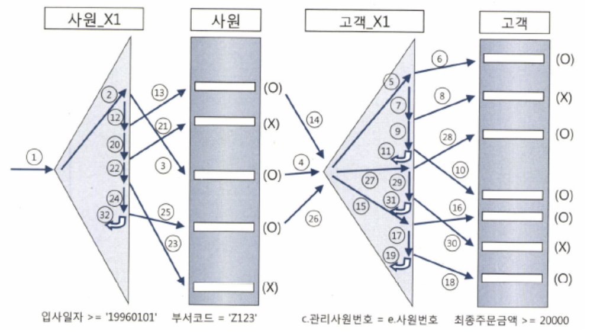

# 조인 튜닝

## 조인 튜닝

### NL 조인 기본 매커니즘

- 건마다 조인 가능한 레코드를 찾아 탐색하는 구조
- Outer와 Inner 양쪽 테이블 모두 인덱스 이용
- Nested Loop 구조와 동일
- 인덱스를 이용한 조인 방식
- Outer은 사이즈가 크지 않다면 인덱스 생략이 가능하지만 Inner는 인덱스가 필수

### NL 조인 실행 계획 제어

- use_nl 힌트 사용
    - NL 방식으로 조인하라고 지시

    ```sql
    select /*+ ordered use_nl(c) */ e.사원명, c.고객명, c.전화번호 
    from 사원 e, 고객 c 
    where e.입사일자 >= '19960101'
    and c.관리사원번호 = e.사원번호 
    ```

    - 아래 경우는 A→B→C→D 순으로 조인하되 D와 조인할 때만 해시 사용

    ```sql
    select /*+ leading(C, A, D, B) use_nl(A) use_nl(D) use_hash(B) */ 
    from A, B, C, D 
    where ... 
    ```


### NL 조인 수행 과정 분석

- 인덱스 구성이 다음과 같다고 가정

    ```sql
    사원_PK : 사원번호 
     사원_X1 : 입사일자 
     고객_PK : 고객번호 
     고객_X1 : 관리사원번호 
     고객_X2 : 최종주문금액
    ```

- 실행 과정 도식화


    - 각 단계를 모두 완료하고 다음 단계로 넘어가는 것이 아니라 한 레코드씩 순차적으로 진행

### NL 조인 튜닝 포인트

- 사원X_1인덱스를 읽고 사원 table에서 엑세스 필터링하는 비율이 높다면 필터링 되는 컬럼을 사원_X1에 추가하는방안 고려
- 고객_X1인덱스를 일고 고객 table에서 엑세스 필터링하는 비율이 높다명 필터링 되는 컬럼을 고객_X1에 추가하는 방안 고려
- 맨 처음 액세스 하는 사원_X1 인덱스에서 얻은 결과 건수에 의해 전체 일량이 좌우

### NL 조인 특징 요약

- 랜덤 액세스 위주의 조인 방식이기에대량 데이터 조인 시에 NL 조인 불리
- 조인을 한 레코드씩 순차적으로 진행해서 부분적인 처리 가능
- 인덱스 전략 구성이 매우 중요
- 온라인 트랜잭션 처리 시스템에 적합한 방식

### NL 조인 확장 매커니즘

- Prefetch
    - 인덱스를 이용해 테이블을 엑세스하다가 디스크 I/O가 필요해지면, 이어서 곧 읽게 될 블록까지 미리 읽어서 버퍼캐시에 적재하는 기능
- 배치 I/O 실행 계획
    - 11g부터는 배치 I/O 메커니즘이 작동하기 때문에 일정 순서로 출력되기를 원한다면 no_nlj_batching(b) 힌트를 추가하거나 맨 바깥쪽에 ****ORDER BY  절에 정렬 기준을 명시

## 소트 머지 조인

### SGA vs PGA

**SGA**

- 캐시된 데이터는 여러 프로세스가 공유 가능
- 여러 프로세스가 공유 가능하지만 동시에 액세스는 불가능
- 동시에 액세스하려면 프로세스 간 액세스를 직렬화하기 위한 Lock 매커니즘으로 Latch가 존재
- 데이터 블록과 인덱스 블록을 캐싱하는 DB 버퍼캐시는 SGA의 가장 핵심적인 구성 요소

**PGA**

- 오라클 서버 프로세스는 SGA에 공유된 데이터를 읽고 쓰면서 동시에 자신만의 고유 메모리 영역을 가짐
- 각 오라클 서버 프로세스에 할당된 메모리 영역을 PGA라고 부르며 프로세스에 종속적인 고유 데이터 저장 용도로 사용
- 할당받은 PGA 공간이 작아 데이터를 모두 저장할 수 없을 때는 Temp 테이블 스페이스 이용
- PGA는 다른 프로세스와 공유하지 않는 독립적인 메모리 공간이기에 래치 매커니즘 불필요
- 같은 양의 데이터를 읽더라도 SGA 버퍼 캐시에서 읽을 때보다 훨씬 빠름

### 기본 매커니즘

- 소트 단계: 양쪽 집합을 조인 컬럼 기준으로 정렬
- 머지 단계: 정렬한 양쪽 집합을 서로 머지
- 힌트: use_merge(c)
- 조인 컬럼에 인덱스가 있어도 NL조인은 대량 데이터 조인할 때 불리하므로 소트 머지 조인을 사용할 수 있음

### 소트 머지 조인의 주용도

- 소트 머지 조인 대신 대부분 해시 조인 사용
- 해시 조인은 동치 조건이 아닐 때 사용할 수 없기 때문에 아래일 때 주로 소트 머지 조인 사용
    - 조인 조건이 동치가 아닌 대량 데이터 조인
    - 조인 조건식이 아예 없는 조인

## 해시 조인

### 기본 매커니즘

- Build 단계: 작은 쪽 테이블을 읽어 해시테이블 생성
- Probe 단계: 큰쪽 테이블을 읽어 해시 테이블을 탐색하며 조인
- Hint: use_hash(c)
- 해시 테이블은 PGA 영역에 할당된 Hash Area에 저장
    - 너무 크면 Temp tablespace 이용

### 해시 조인이 빠른 이유

- PGA 영역을 할당하기 때문에 래치 획득 과정 없이 빠르게 데이터 탐색 및 조회
- 해시 조인도 Build Input Probe Input 각 테이블을 읽을 때는 DB 버퍼 캐시 공유

### 대용량 Build Input 처리

- 두 테이블 모두 대용량이라서 인메모리 해시 조인이 불간으할 때
- DBMS는 분할 정복 방식 사용

### 해시 조인 실행계획 제어

- 옵티마이저는 일반적으로 카디널리티가 작은 테이블을 Build Input으로 선택

### 조인 메소드 선택 기준

- 소량 데이터 조인 → NL 조인
- 대량 데이터 조인 → 해시 조인
- 대량 데이터 조인인데 해시 조인으로 처리할 수 없을 때 (조건식이 등치 조건이 아닐 때) → 소트머지 조인
- 같은 성능이라면 해시보다는 NL을 선택하는 게 OLTP성 DB에 좋음
- 해시 조인은 CPU와 메모리 사용이 크게 증가하고, 해시 맵을 만드는 과정에 여러 가지 래치 경합도 발생

## 서브쿼리 조인

### 서브쿼리 변환이 필요한 이유

**필터 방식**

- 필터 오퍼레이션: 서브 쿼리를 필터 방식으로 처리하는 방법
- 필터 방식이란 마치 NL 조인처럼 동작하도록 하는 방식
- 두 개의 쿼리를 각각 최적화하지 않고 NL 조인처럼 하나의 쿼리로 판단하여 최적화

**NL 조인과의 차이점**

- 서브 쿼리 조건절에 해당하는 값이 존재하면 조건절이 참이 되었기에 바로 중단
- 서브 쿼리 조건절에 따른 결과를 캐싱
- 항상 메인 쿼리가 Outer, 서브 쿼리가 Inner

**Unnesting 방식**

- unnest 힌트로 유도 가능
- 서브 쿼리가 메인 쿼리보다 먼저 처리될 수 있음
- 다양한 최적화 기법을 ㅈ루 수 있어 필터 방식보다 좋은 실행 경로 찾기 가능
- 서브 쿼리에 ROWNUM을 사용하면 unnest 힌트를 사용한다고 하여도 서브 쿼ㅗ리를 최적화하지 않으니 ROWNUM을 쓸 때 조심

**서브 쿼리 Pushing**

- 조건절에 존재하는 서브 쿼리에 해당하는 데이터가 적다면 서브 쿼리 먼저 수행되는 것이 좋음
- 하지만 필터 방식의 서브 쿼리는 대게 맨 마지막에 ㅓ리되기에 이를 가장 먼저 처리되도록 강제하는 기능
- push_subq 힌트로 유도
- 필터 방식에서만 사용 가능하기 때문에 no_unnest 힌트와 같이 사용
- 가장 나중에 처리하게 하려면 no_pupsh_subq 사용

### VIEW와 조인

- 인라인 뷰도 옵티마이저가 서브 쿼리를 독립적으로 나눠서 최적화하기 때문에 merge 힌트를 사용하여 다르게 처리 가능

### 스칼라 서브쿼리 조인

- 스칼라 서브 쿼리는 NL 조인 방식으로 실행
- 필터 서브 쿼리처럼 스칼라 서브 쿼리도 캐싱 기능을 사용하여 동일한 입력값에 대해서 캐싱
- 스칼라 서브 쿼리는 2개 이상의 항목을 조회할 수 없으므로 해당 쿼리를 인라인 뷰로 사용하는 것이 나음
- 스칼라 서브 쿼리도 unnest 사용이 가능