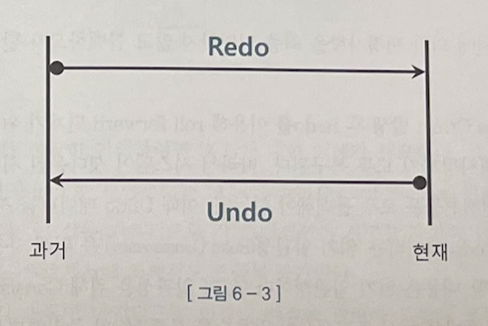
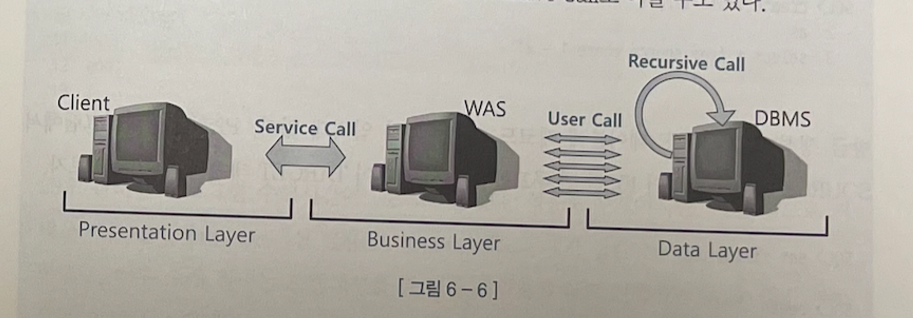
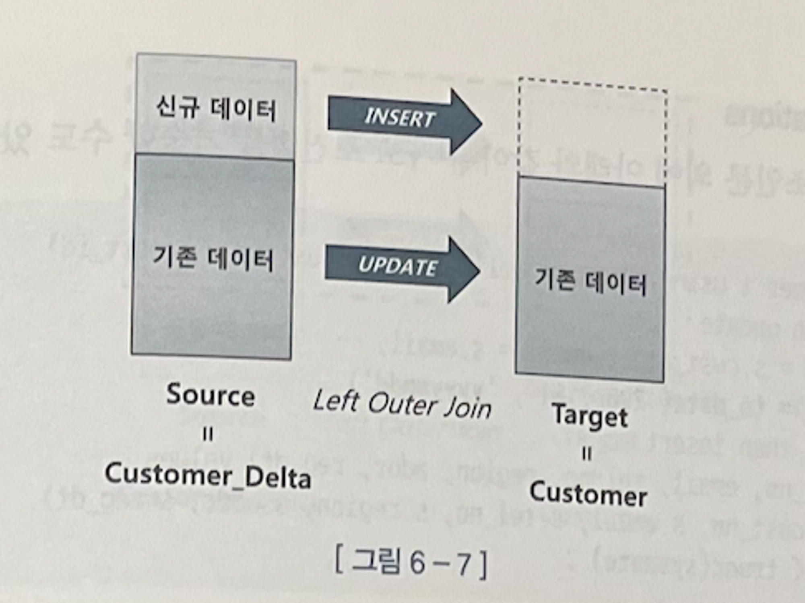

## 1. 기존 DML 튜닝

### DML 성능에 영향을 미치는 요소

1. 인덱스
    1. 개수 만큼 속도가 느려진다.
    2. 수직점 탐색으로 입력할 블록을 찾아야해서 DML성능에 미치는 영향이 크다.
2. 제약 조건
    1. 개체 무결성
    2. 참조 무결성
    3. 도메인 무결성
    4. 사용자 정의 무결성
3. 조건절
4. 서브쿼리
5. ReDo , Undo(RollBack)로깅
    1. 데이터 파일과 컨트롤 파일에 가해지는 모든 변경사항을 Redo로그에 기록한다. → 이걸 통해서 유실 이전 상태로 복구 하는데 사용된다. (그래서 Insert 작업에 대해서는 Redo 로그에 기록하지
       않는다)
    2. Redo 로그는 아래 세 가지 목적에 사용된다.
        1. Database Recovery
        2. Cache Recovery (instance Recovery &
        3. Fast Commit
    3. Redo는 트랜잭션을 재 현함으로써 과거를 현재 상태로 되돌리는 데 사용하고, Undo는 트랜잭션을 롤백함으로써 현재를 과거 상태로 되돌리는 데 사랑한다

       

6. Lock
    1. Lock을 필요 이상으로 걸면 DML성능이 느려지고 너무 적게 걸면 데이터 품질이 나빠진다. ⇒ 두마리 토끼를 모두 잡기 위해서는 세심한 동시성 제어가 필요한다.
7. 커밋
    1. DML과 별개 지만 commit이 진행되어야 DML이 종료 되어 중요하다.
    2. 모든 DBMS가 FastCommit을 구현 하고 있다.
    3. 커밋 내부 메커니즘
        1. DB 버퍼 캐시
            1. 버퍼캐시에서 변경된 블록을 모아 주기적으로 데이터 파일에 일괄 기록하는 작업은 DBWR프로세스가 맡는다. 일을 건건이 처리하지 않고 모았다가 한번에 일괄 처리한다.
        2. Redo 로그 버퍼
            1. 버퍼 캐시는 휘발성이여서 불안한상태라고 생각하지 않아도 된다. 버퍼캐시가 가한 변경사항을 Redo로그에도 기록해 두었기 때문이다. Oracle은 이를 해결하기 위해 로그 버퍼를 사용한다.
        3. 트랜잭션 데이터 저장과정

           

            1. DML 문을 실행하면 Redo 로그버퍼에 변경사항을 기록한다.
            2. 버퍼블록에서 데이터를 변경(레코드 주가/수정/삭제) 한다. 물론, 버퍼캐시에서 블록을 찾지 못하면, 데이터파일에서 읽는 작업부터 한다.
            3. 커밋한다.
            4. LGWR 프로세스가 Redo 로그버퍼 내용을 로그파일에 일괄 저장한다.
            5. DBWR 프로세스가 변경된 버퍼블록들은 데이터파일에 일괄 저장한다.
        4. 커밋 = 저장버튼
            1. LGWR프로세스에 신호를 보낸후 작업을 완료했다는 신호를 받아야 다음 작업을 진행할 수 있다 . (SYNC) 디스크 I/O작업이다. ⇒ 트랜잭션을 논리적으로 잘 정의함으로써 불필요한 커밋이
               발생하지 않도록 구현해야한다.

### 데이터 베이스 Call과 성능

1. SQL은 아래 세 단계로 나누어 실행된다.
    - Parse Call: SQL 파싱과 최적화를 수행하는 단계다. SQL과 실행계획을 라이브러리 캐시에서 찾으면, 최적화 단계는 생략할 수 있다.
    - Execute Call : 말 그대로 SQL을 실행하는 단계다. DML은 이 단계에서 모든 과정 이 끝나지만, SELECT 문은 Fetch 단계를 거친다.
    - Fetch Call : 데이터를 읽어서 사용자에게 결과집합을 전송하는 과정으로 SELECT 문에서만 나타난다. 전송할 데이터가 많을 때는 Fetch Call이 여러 번 발생한다.
2. Call 의 발생 지점

   

    1. User Call :
        1. 네트워크를 경유해 DBMS 외부로부터 인입되는 Call이다.
        2. 최종 사용자(User)는 맨 왼쪽 클라이언트 단에 위치한다.
        3. 하지만, DBMS 입장에서 사용자는 WAS (또는 AP 서버)다.
        4. 3-Tier 아키텍처에서 User Call은 WAS(또는 AP서버) 서버에서 발생하는 Call 이다.
    2. Recursive Call :
        1. DBMS 내부에서 발생하는 Call이다.
        2. SQL 파싱과 최적화 과정에서 발생하 는 데이터 덕셔너리 조회, PL/SQL로 작성한 사용자 정의 함수/프로시저/트리거에 내장된 SAL을 실행할 때 발생하는 Call이 여기에 해당한다.

데이터 베이스 Call이 많으면 성능은 느릴 수밖에 없다. 특히 네트워크를 경유하는 User Call이 성능에 미치는 영향이 크다.

이렇기에 OneSql로 처리하는것이 중요하다. 아래 방법을 활용하여 진행한다.

1. Insert Into Select
2. 수정 가능 조인 뷰
3. Merge 문

### Array Processing 활용

하지만 업무 환경은 복잡하기에 One SQL로 구현 하기 어렵다. 이때 Array Processing 으로 처리하면 One SQL로 구현하지 않아도 Call 부하를 줄일 수 있다.

### 인덱스 및 제약 해제를 통한 대량 DML 튜닝

동시 트랜잭션 없이 대량 데이터를 적재하는 배치 프로그램에서는 이들 기능(인덱스 및 제약해제)을 해제하여 성능을개선할 수 있다.

PK 제약과 인덱스 해제 1- PK 제약에 Unique 인덱스를 사용한 경우

PK 제약과 인덱스 해제 2- PK 제약에 Non-Unique 인덱스를 사용한 경우

### 수정 가능 조인뷰

수정 가는 조인뷰를 활용하면 참조 테이블과 두 번 조인하는 비효율을 없앨 수 있다.

수정가능 조인 뷰는 입력, 수정 ,삭제가 허용되는 조인 뷰이다.

### Merge문 활용

DW에서 가장 흔히 발생하는 오퍼레이션은 기간계 시스템에서 가져온 신규 트랜잭션 데이터 를 반영함으로써 두 시스템 간 데이터를 동기화하는 작업이다



Merge(upsert = update + insert)

조인에 성공하면 Update, 실패하면 Insert

1. Optional Clauses
2. Conditional Operations
3. DELETE Clause

## 2. Direct Path I/O 활용

### Direct Path I/O

일반적인 블록 I/O는 버퍼캐시를 경유한다.

그래서 오라클은 버퍼캐시를 경유하지 않고 곧바로 디이티 블록을 읽고 쓸 수 있는 Direct Path I/O 기능을 제공한다. 아래는 그 기능이 작동하는 정우다.

1. 병렬 쿼리로 FullScan을 수행할 때
2. 병렬 DML을 수행할 때
3. Direct Path Insert를 수행할 때
4. Temp 세그먼트 블록들을 읽고 쓸 때

5, direct 옵션을 지정하고 expOrt를 수행할 때

6. nocache 옵션을 지정한 LOB 컬럼을 읽을 때

### Direct Path Insert

1. 데이터를 입력할 수 있는 블록을 Freelist에서 찾는다. 테이블 HWM(High - Water - Mark)  아래쪽에 있는 블록 중 데이터 입력이 가능한(여유 공간이 있는 블록을 목록으로 관리하는데. 이를
   Freelist라고 한다.
2. Freelist에서 할당받은 블록을 버퍼캐시에서 찾는다.
3. 버퍼캐시에 없으면, 데이터파일에서 읽어 버퍼캐시에 적재한다.
4. INSERT 내용을 Undo 세그먼트에 기록한다.
5. INSERT 내용을 Redo 로그에 기독한다.

Direct Path Insert 방식을 사용하면, 대량 데이터를 일반적인 INSERT 보다 훨씬 더 빠르게 입력할 수 있다. 데이터를 Direct Path Insert 방식으로 입력하는 방법은 다음과 같다.

1. INSBRT … SELCET 문에 append 힌트 사용
2. parallel 힌트를 이용해 병렬 모드로 INSHRT
3. drect 옵션을 지정하고 S@L*Loaderfeauldt)로 데이터 적재
4. CTAS(create table … as select) 문 수행

Direct Path Insert 방식이 빠른 이유는 다음과 같다.

1. Freelist를 잡조하지 않고 HWM 바깥 영역에 데이터를 순차적으로 입력한다.
2. 블록을 버퍼캐시에서 탐색하지 않는다.
3. 버퍼캐시에 적재하지 않고, 데이터파일에 직접 기록한다.
4. Undo 로깅을 안 한다
5. Redo 로깅을 안 하게 할 수 있다.

이 때 주의해야할 점이 있다.

1. 성능은 비교할 수 없을 정도로 빨라지지만 Exclusive 모드 TM Lock이 걸린다. (트랜잭션이 빈번한 주간에 이 옵션을 사용하는 것은 절대 금물이다)
2. Preelist를 조회하지 않고 HWM 바깥 영역에 입력하므로 테이블에 여유 공간이 있어 도 재활용하지 않는다는 사실이다

### 병렬 DML

INSERT는 append힌트로 유도할 수 있지만 U,D는 불가능한다 이를 해결하기 위해 병렬 DML로 처리할 수 있다.

```jsx
alter
session
enable
parallel
dml
```

그러고 나서 각 DML. 문에 아래와 같이 힌트를 사용하면, 대상 레코드를 찾는 작업(INSERT는 SELECT 쿼리, UPDATE/DELETE 조건절 검색)은 물론 데이터 추가/변경/삭제도 병렬로 진행한다.

힌트를 기술 않는 경우 DML을 병렬로 활성화 하지 않은 경우 대상 레코드를 찾는 작업은 병렬로 수행하지만 추가/변경/삭제를 QC가 혼자 담당하여 병목이 생긴다.

병렬 INSBRT는 append 힌트를 지정하지 않아도 Direct Path Insert 방식을 사용한다. 하지만, 병렬 DML이 작동하지 않을 경우를 대비해 아래와 같이 append 힌트를 같이 사용하는 게 좋다.
혹시라도 병렬 DML이 작동하지 않더라도 QC가 Direct Path Insert를 사용하면 어느정도 만족할 만한 성능을 낼 수 있기 때문이다.