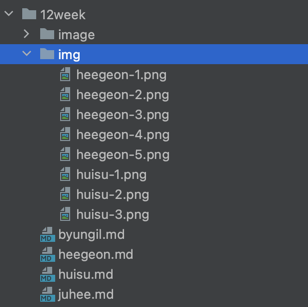

## 📈 SQL-tuning
#### SQL tuning 책을 읽고 스터디를 진행하며 정리한 내용입니다.

### 🗓️ 스터디 기간 (2024.05.13 ~)
|          진행 기간          | 목차  |    진행내용    |
|:-----------------------:|:---:|:----------:|
| 2024.05.07 ~ 2024.05.13 |   |   |
| |   |   |
| |   |   |
| |   |   |
| |   |   |

### 🚗 스터디 진행 방식
> [이펙티브 자바 스터디 by Javabom](https://javabom.tistory.com/70)
> 의 스터디 방식을 참고하였습니다.

- SQL tuning 도서를 매주 계획된 양 만큼 읽고 정리한 내용을 공유합니다.
- 모든 스터디원은 해당 주차에 맞는 내용을 읽고 이해가 되지 않거나 도움이 필요한 부분을 이슈로 등록합니다.
- 매주 한 명씩 돌아가면서 Reviewer 역할을 맡습니다.
- Reviewer는 해당 주에 읽은 내용을 확실하게 이해하고 다른 스터디원들의 이슈에 답변합니다.
- 회의가 진행될 떄 Reviewer가 주도적으로 이슈를 살펴보며 답변 내용을 공유합니다.
- 질문과 별개로 모든 스터디원은 읽은 내용을 요약, 정리하여 PR을 보내야 합니다.

### 📐 규칙
1. 3번 이상 불참 시 스터디 탈퇴
2. 불참이 예상될 시 미리 공유
3. 매주 토요일(23:55) 까지 질문 이슈 등록
4. Reviewer는 회의 전까지 질문 이슈에 답변
5. 매주 월요일 9시 회의 전까지 요약 PR 생성

### 💫브랜치,커밋 전략
- 브랜치 전략
  - `${n}week/name`
- 파일 관리 전략 
  - 폴더 구조 , `${n}week` 폴더내에 `name.md`로 생성
  - 이미지가 있는 경우 `${n}week/img`폴더에 `name-${number}.img`로 저장
  
- 커밋 전략 
  - 내용 요약시 `feat : ✅${n}주차 독서완료 했습니다.`
  - 문서 작업 시 ` 📝docs: ${내용}`

